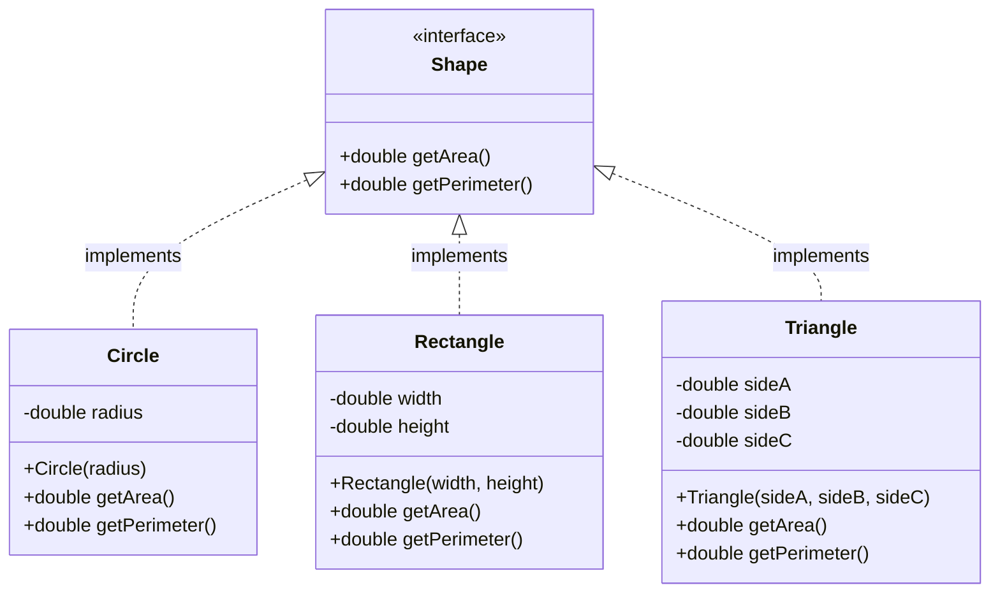
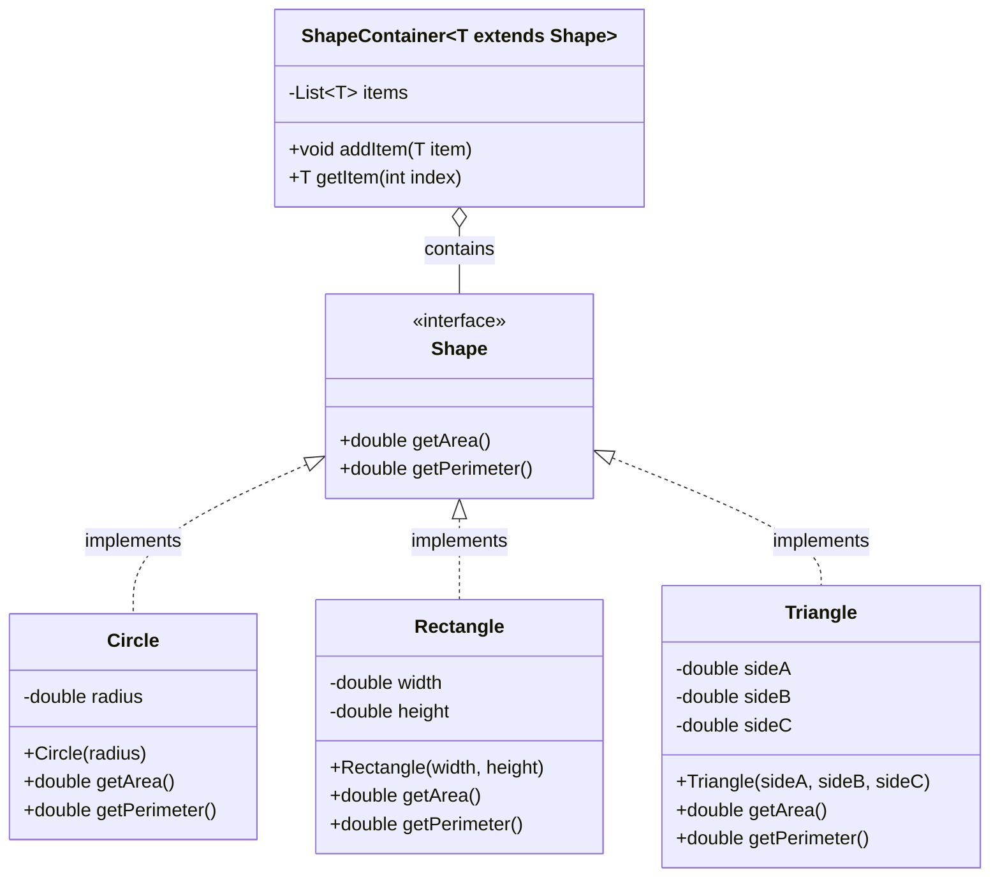

# Generic

## 실습 

### 실습 1) String 비교

- 문자열 비교시 '==' 와 'equals()'를 사용하는 코드를 작성하시오
- 문자열 비교시 '=='를 사용하면 안되는 이를 설명 하시오

```java
void main() {
    // 1. 문자열 생성 방법
    String str1 = "Apple"; // String Constant Pool (문자열 상수 풀)에 저장
    String str2 = "Apple"; // str1과 동일한 객체를 참조

    String str3 = new String("Apple"); // 힙 영역에 새로운 String 객체 생성
    String str4 = "apple"; // 내용이 다름 (대소문자 다름)

    IO.println("--- String 비교 예제 ---");

    // 2. 내용 비교: equals() (권장)
    IO.println("\n[equals() : 내용 비교]");

    // 내용이 같으므로 true
    IO.println("str1.equals(str2): " + str1.equals(str2)); // true

    // 내용이 같고, 서로 다른 메모리 객체여도 true 반환
    IO.println("str1.equals(str3): " + str1.equals(str3)); // true

    // 내용이 다름 (대소문자 차이)
    IO.println("str1.equals(str4): " + str1.equals(str4)); // false


    // 3. 참조 비교: == (비권장)
    IO.println("\n[== : 참조(메모리 주소) 비교]");

    // 상수 풀에서 같은 객체를 참조하므로 true
    IO.println("str1 == str2: " + (str1 == str2)); // true

    // str3은 new 연산자로 힙에 생성된 다른 객체이므로 false
    IO.println("str1 == str3: " + (str1 == str3)); // false


    // 4. 대소문자 무시 비교: equalsIgnoreCase()
    IO.println("\n[equalsIgnoreCase() : 대소문자 무시 내용 비교]");

    // 내용이 같고 대소문자만 다르므로 true
    IO.println("str1.equalsIgnoreCase(str4): " + str1.equalsIgnoreCase(str4)); // true
}
```

### 실습 2) 인터페이스 상속

- 다음의 클래스 다이어그램을 참고하여 인터페이스와 클래스를 작성하시오
- 각 클래스의 메서드를 구현하시오. (AI챗을 적극 활용하시오)
- 각 클래스를 활용하는 예제 코드를 void main()에 작성하시오 
  



### 실습 3) Generic 

- 다음의 클래스 다이어그램을 코드로 표현하시오
- ShapeContainer<T> 클래스를 활용한 예제를 코딩해보시오.



```java
// Shape 인터페이스: 모든 도형의 규약

interface Shape {
    double getArea();
}

// Circle 구현 클래스
class Circle implements Shape {
    private double radius;

    Circle(double radius) {
        this.radius = radius;
    }

    @Override
    public double getArea() {
        return Math.PI * radius * radius;
    }

    @Override
    public String toString() {
        return "Circle (R=" + radius + ")";
    }
}

// Rectangle 구현 클래스
class Rectangle implements Shape {
    private double width;
    private double height;

    Rectangle(double width, double height) {
        this.width = width;
        this.height = height;
    }

    @Override
    public double getArea() {
        return width * height;
    }

    @Override
    public String toString() {
        return "Rectangle (W=" + width + ", H=" + height + ")";
    }
}


// Generic ShapeContainer<T> 클래스
// T는 반드시 Shape 인터페이스를 구현해야 합니다. (타입 상한 제한)
class ShapeContainer<T extends Shape> {
    private List<T> items = new ArrayList<>();

    public void addItem(T item) {
        items.add(item);
    }

    public T getItem(int index) {
        return items.get(index);
    }

    // 컨테이너에 담긴 모든 도형의 면적 합계를 계산하는 메소드
    public double getTotalArea() {
        double totalArea = 0.0;
        for (T item : items) {
            // T는 Shape를 상속했으므로, getArea() 메소드 호출이 보장됨.
            totalArea += item.getArea();
        }
        return totalArea;
    }
}

void main() {
    IO.println("--- Generic ShapeContainer 활용 예제 ---");

    // 1. Circle 타입만 담을 수 있는 컨테이너 생성
    ShapeContainer<Circle> circleContainer = new ShapeContainer<>();
    circleContainer.addItem(new Circle(5.0));
    circleContainer.addItem(new Circle(2.0));
    // circleContainer.addItem(new Rectangle(1, 1)); // 🚨 컴파일 에러 (Circle만 허용)

    IO.println("1. 원 컨테이너 생성 및 면적 합계:");
    IO.println("   첫 번째 원: " + circleContainer.getItem(0));
    IO.println("   면적 합계: " + circleContainer.getTotalArea());

    // 2. Shape 타입(제일 넓은 범위)을 담을 수 있는 컨테이너 생성
    // 이 컨테이너는 Circle, Rectangle 등 모든 Shape 구현체를 허용합니다.
    ShapeContainer<Shape> mixedContainer = new ShapeContainer<>();
    mixedContainer.addItem(new Circle(3.0)); // Pi * 9 = 28.27
    mixedContainer.addItem(new Rectangle(4.0, 5.0)); // 20.0

    IO.println("\n2. 혼합 도형 컨테이너 생성 및 면적 합계:");
    IO.println("   담긴 도형 수: " + ((ArrayList) mixedContainer.items).size()); // items가 private지만 예시를 위해 접근
    IO.println("   총 면적 합계: " + mixedContainer.getTotalArea()); // 28.27 + 20.0 = 48.27
}

```