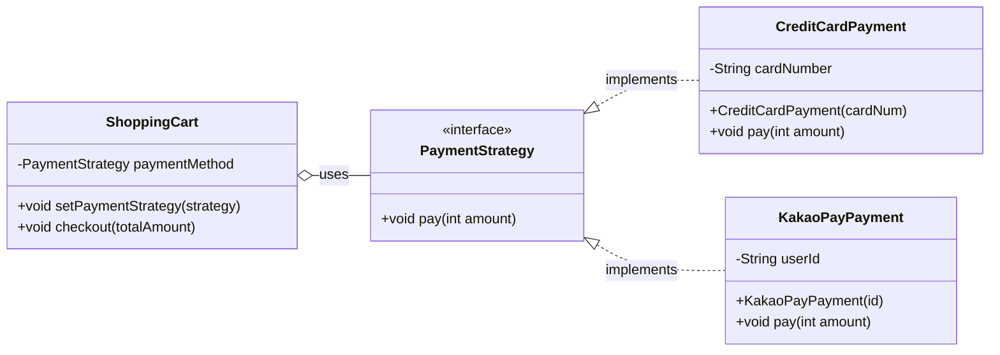

# 04.03 Strategy 패턴

이 패턴은 관련 알고리즘이나 행동들을 캡슐화하고, 이들을 상호 교환 가능(interchangeable)하게 만드는 것을 목표로 합니다.

클라이언트(사용자)는 실행 시점에 특정 전략(Strategy)을 선택하여 객체의 행동을 유연하게 변경할 수 있습니다.

- 유연성 : Context 클래스는 자신의 행동을 수행할 때 어떤 전략을 사용할지 결정하며, 전략만 교체함으로써 Context의 동작을 쉽게 변경할 수 있습니다. 
- 개발-폐쇄 원칙 준수 : 새로운 전략을 추가하더라도 Context 클래스의 코드를 수정할 필요가 없습니다. (확장에는 개방, 수정에는 폐쇄))
- 단일 책임 원칙 : Context는 자신의 역할(전략 사용)에만 집중하고, 전략 객체들은 자신의 역할(알고리즘 구현)에만 집중합니다. 


## 구현 예제



```java

// Strategy 인터페이스: 모든 결제 방식의 규약
interface PaymentStrategy {
    void pay(int amount);
}

// ConcreteStrategy 1: 카드 결제 전략
class CreditCardPayment implements PaymentStrategy {
    private String cardNumber;

    CreditCardPayment(String cardNum) {
        this.cardNumber = cardNum;
    }

    @Override
    public void pay(int amount) {
        IO.println("=> [카드 결제] " + amount + "원. 카드 번호 " + cardNumber.substring(0, 4)
                + "**** 로 결제 완료.");
    }
}

// ConcreteStrategy 2: 카카오페이 결제 전략
class KakaoPayPayment implements PaymentStrategy {
    private String userId;

    KakaoPayPayment(String id) {
        this.userId = id;
    }

    @Override
    public void pay(int amount) {
        IO.println("=> [카카오페이] " + amount + "원. 사용자 ID " + userId + "로 QR 코드 결제 요청 완료.");
    }
}

// Context: Strategy 객체를 가지고 실제 결제를 위임하는 클래스
class ShoppingCart {
    private PaymentStrategy paymentMethod;

    // 결제 전략을 주입받는 메소드 (실행 시점에 교체 가능)
    public void setPaymentStrategy(PaymentStrategy strategy) {
        this.paymentMethod = strategy;
    }

    // 결제 실행 메소드: 실제 결제는 전략 객체에 위임
    public void checkout(int totalAmount) {
        if (paymentMethod == null) {
            IO.println("🚨 오류: 결제 수단이 설정되지 않았습니다.");
            return;
        }
        IO.println("--- 총 " + totalAmount + "원 결제를 시작합니다. ---");
        // 핵심: Context는 pay()를 호출할 뿐, 내부 구현은 알지 못함.
        this.paymentMethod.pay(totalAmount);
    }
}

void main() {
    IO.println("--- Strategy 패턴 활용 예제 (결제 시스템) ---");

    // 1. Context 객체 생성
    ShoppingCart cart = new ShoppingCart();
    int amount = 55000;

    // 2. 전략 1 설정 및 실행 (카드 결제)
    IO.println("\n[첫 번째 결제 시도: 카드]");
    PaymentStrategy creditCard = new CreditCardPayment("1234-5678-9012-3456");
    cart.setPaymentStrategy(creditCard);
    cart.checkout(amount);

    // 3. 전략 2로 교체 및 실행 (카카오페이)
    IO.println("\n[두 번째 결제 시도: 카카오페이로 전략 교체]");
    PaymentStrategy kakaoPay = new KakaoPayPayment("user_alice");
    cart.setPaymentStrategy(kakaoPay); // 실행 시점에 전략 교체
    cart.checkout(amount);
}

```


## [⁉️ 실습 하기 (click)](04.03-실습%20Strategy%20패턴.md)