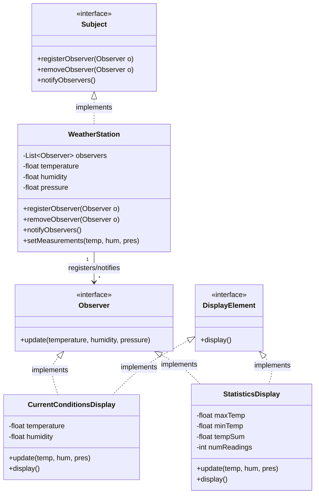

# 04.04 Subscribe-Publish 패턴

## 실습

### 실습 1) Observer pattern

- Observer pattern을 구현해 보시오(AI 챗 활용)
- Pub/Sub 패턴과 비교하시오.

> 📋 Observer pattern
> 한 객체의 상태 변화에 따라 다른 객체들에게 자동으로 알림을 전달하고 자신의 상태를 갱신하도록 하는 패턴입니다.
> - 자동 알림 : Subject(주제)의 상태가 변하면, 등록된 모든 Observer(옵저버)들에게 자동으로 알림을 보냅니다.
> - 느슨한 결합 : Subject는 자신이 통지하는 Observer의 구체적인 타입이나 개수를 알 필요가 없습니다. 오직 Observer 인터페이스만 참조합니다.
> - 유연한 확장 : 새로운 Observer가 추가되더라도 Subject 코드는 수정할 필요가 없습니다




```java
// Observer 패턴 구현 예제 (날씨 정보 시스템)

// Subject 인터페이스: 옵저버를 관리하는 계약
interface Subject {
    void registerObserver(Observer o);

    void removeObserver(Observer o);

    void notifyObservers(); // 상태가 변경되었을 때 모든 옵저버에게 알림
}

// Observer 인터페이스: 알림을 받는 모든 객체의 계약
interface Observer {
    void update(float temperature, float humidity, float pressure);
}

// DisplayElement 인터페이스: 화면 출력을 위한 인터페이스
interface DisplayElement {
    void display();
}

// ////////////// 구현 클래스들 : Subject
class WeatherStation implements Subject {
    private List<Observer> observers;
    private float temperature;
    private float humidity;
    private float pressure;

    public WeatherStation() {
        observers = new ArrayList<>();
    }

    @Override
    public void registerObserver(Observer o) {
        observers.add(o);
    }

    @Override
    public void removeObserver(Observer o) {
        observers.remove(o);
    }

    @Override
    public void notifyObservers() {
        for (Observer observer : observers) {
            // 등록된 모든 옵저버의 update() 메소드 호출
            observer.update(temperature, humidity, pressure);
        }
    }

    // 상태 변경 메소드: 이 메소드가 호출되면 옵저버들에게 알림을 보냄
    public void measurementsChanged() {
        notifyObservers();
    }

    // 외부로부터 새로운 날씨 데이터를 받음
    public void setMeasurements(float temperature, float humidity, float pressure) {
        this.temperature = temperature;
        this.humidity = humidity;
        this.pressure = pressure;
        measurementsChanged(); // 상태가 바뀌었으니 즉시 옵저버들에게 알립니다.
    }
}


// ////////////// 구현 클래스 : Observer  

class CurrentConditionsDisplay implements Observer, DisplayElement {
    private float temperature;
    private float humidity;

    // Subject를 참조할 필요는 없지만, Subject에서 제거하기 위해 받을 수 있음.
    // 여기서는 알림을 받는 역할만 합니다.

    @Override
    public void update(float temperature, float humidity, float pressure) {
        this.temperature = temperature;
        this.humidity = humidity;
        display();
    }

    @Override
    public void display() {
        IO.println("-> [현재 조건] 온도: " + temperature + "°C, 습도: " + humidity + "%");
    }
}
class StatisticsDisplay implements Observer, DisplayElement {
    private float maxTemp = 0.0f;
    private float minTemp = 200.0f;
    private float tempSum = 0.0f;
    private int numReadings = 0;

    @Override
    public void update(float temperature, float humidity, float pressure) {
        tempSum += temperature;
        numReadings++;

        if (temperature > maxTemp) {
            maxTemp = temperature;
        }
        if (temperature < minTemp) {
            minTemp = temperature;
        }
        display();
    }

    @Override
    public void display() {
        IO.println("-> [통계] 평균/최대/최소 온도: " + (tempSum / numReadings) + "°C / " + maxTemp + "°C / "
                + minTemp + "°C");
    }
}

void main() {
    IO.println("--- Observer 패턴 구현 및 실행 ---");

    // 1. Subject 객체 생성
    WeatherStation weatherStation = new WeatherStation();

    // 2. Observer 객체 생성
    CurrentConditionsDisplay currentDisplay = new CurrentConditionsDisplay();
    StatisticsDisplay statisticsDisplay = new StatisticsDisplay();

    // 3. 옵저버 등록
    weatherStation.registerObserver(currentDisplay);
    weatherStation.registerObserver(statisticsDisplay);

    IO.println("\n[첫 번째 측정 데이터 전송]");
    // 4. 상태 변경 -> 모든 옵저버에게 자동 알림
    weatherStation.setMeasurements(25.5f, 65.0f, 1012.1f);

    IO.println("\n[두 번째 측정 데이터 전송]");
    // 5. 다시 상태 변경 -> 모든 옵저버에게 자동 알림
    weatherStation.setMeasurements(27.0f, 60.5f, 1010.5f);

    IO.println("\n[옵저버 제거 후 세 번째 데이터 전송]");
    // 6. 통계 디스플레이 제거
    weatherStation.removeObserver(statisticsDisplay);

    // 7. 데이터 전송 (제거된 옵저버는 알림을 받지 않음)
    weatherStation.setMeasurements(24.8f, 70.1f, 1013.9f);
}


```

### 실습 2) 메시징 시스템

- 메시징 기능을 지원하는 대표적인 애플리케이션으로는 Kafka, RabbitMQ 등이 있습니다. 
- Kafka와 RabbitMQ의 장단점을 비교하시오 