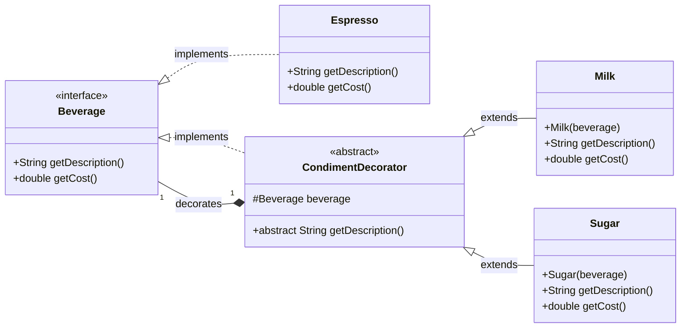

# 04.05 Decorator 패턴

이 패턴은 객체에 동적으로(Runtime) 새로운 기능이나 책임을 추가(장식/Decorator)할 수 있도록 해줍니다. 데코레이터 패턴의 핵심은 상속(Inheritance)을 사용하는 대신 합성(Composition)을 사용하여 기능을 확장하는 것입니다.

- 기능의 동적 추가: 객체의 기능을 실행 시점에 필요한 만큼, 원하는 순서로 유연하게 추가할 수 있습니다.
- 상속의 대안: 상속을 사용하면 새로운 기능이 필요할 때마다 새로운 서브클래스를 만들어야 하는 클래스 폭발(Class Explosion) 문제가 발생합니다. 데코레이터 패턴은 이 문제를 해결합니다.
- OCP (개방-폐쇄 원칙) 준수: 핵심 기능(Component)의 코드를 변경하지 않고 (폐쇄), 새로운 기능(Decorator)을 추가하여 (개방) 시스템을 확장할 수 있습니다.

## 구현 예제 (커피 주문 시스템)


```java
// Component 인터페이스: 가격 계산 규약
interface Beverage {
    String getDescription();

    double getCost();
}

// ConcreteComponent: 기본 커피 객체 (장식될 원본)
class Espresso implements Beverage {
    @Override
    public String getDescription() {
        return "에스프레소";
    }

    @Override
    public double getCost() {
        return 4.0;
    }
}

// Decorator 추상 클래스: Component를 구현하고 Component를 포함
abstract class CondimentDecorator implements Beverage {
    // Component 객체를 참조합니다 (합성).
    protected Beverage beverage;

    // Beverage를 구현했더라도 getDescription은 반드시 오버라이드해야 함을 명시
    @Override
    public abstract String getDescription();
}

// ConcreteDecorator 1: 우유 추가 기능
class Milk extends CondimentDecorator {
    public Milk(Beverage beverage) {
        this.beverage = beverage; // 기존 음료 객체를 받아서 장식
    }

    @Override
    public String getDescription() {
        return beverage.getDescription() + ", 우유";
    }

    @Override
    public double getCost() {
        // 기존 가격에 우유 가격(0.5)을 더함
        return beverage.getCost() + 0.5;
    }
}

// ConcreteDecorator 2: 설탕 추가 기능
class Sugar extends CondimentDecorator {
    public Sugar(Beverage beverage) {
        this.beverage = beverage;
    }

    @Override
    public String getDescription() {
        return beverage.getDescription() + ", 설탕";
    }

    @Override
    public double getCost() {
        // 기존 가격에 설탕 가격(0.2)을 더함
        return beverage.getCost() + 0.2;
    }
}

void main() {
    IO.println("--- Decorator 패턴 활용 예제 (커피 주문) ---");

    // 1. 기본 음료 (ConcreteComponent) 생성
    Beverage coffee = new Espresso();
    IO.println("주문 1: " + coffee.getDescription() + ", 가격: $" + coffee.getCost());

    // 2. 우유(Decorator)로 장식
    coffee = new Milk(coffee); // Milk는 Espresso를 감싼다.

    // 3. 설탕(Decorator)으로 장식
    coffee = new Sugar(coffee); // Sugar는 Milk로 장식된 Espresso를 감싼다.

    // 4. 최종 결과 출력 (기능이 순차적으로 실행됨)
    IO.println("최종 주문: " + coffee.getDescription() + ", 최종 가격: $" + coffee.getCost());
    // 예상 출력: 최종 주문: 에스프레소, 우유, 설탕, 최종 가격: $4.7
}


```


## [⁉️ 실습 하기 (click)](04.05-실습%20Decorator%20패턴.md)