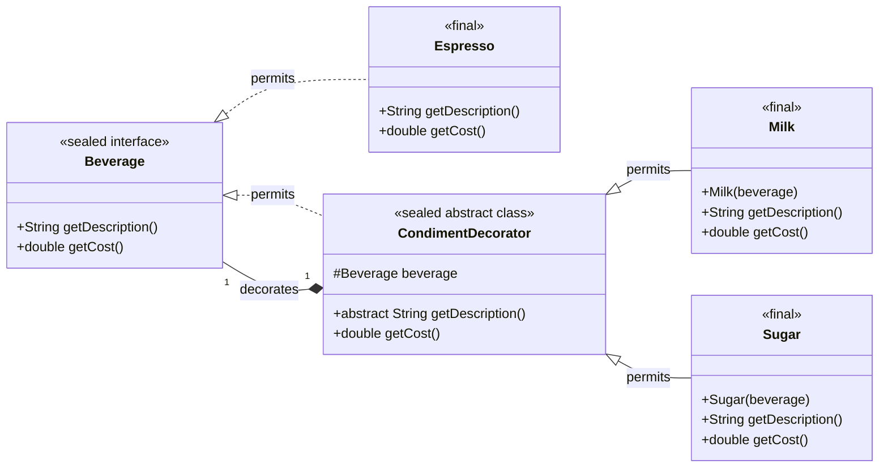

# 04.05 Decorator 패턴

## 실습 

### 실습 1) 상속 보다는 구성

- 객체지향 프로그래밍에서 상속보다는 구성으로 기능을 확장하는 이유를 설명하시오.
- 구성으로 기능을 확장하는 예제를 interface를 사용하여 작성하시오.

### 실습 2) Decorator 패턴을 Sealed 인터페이스로 구현 

- 커피 주문 시스템을 Sealed interface를 사용하여 구현해보시오
- main() 메서드는 변경하면 안됨



```java
// Component 인터페이스: 가격 계산 규약
// sealed를 사용하여 구현 클래스를 명시적으로 제한
sealed interface Beverage permits Espresso, CondimentDecorator {
    String getDescription();

    double getCost();
}

// Decorator 추상 클래스: Component를 구현하고 Component를 포함
// sealed abstract class로 상속 클래스를 제한
sealed abstract class CondimentDecorator implements Beverage permits Milk, Sugar {
    // Component 객체를 참조합니다 (합성).
    protected Beverage beverage;

    // Beverage를 구현했더라도 getDescription은 반드시 오버라이드해야 함을 명시
    @Override
    public abstract String getDescription();
}

// ConcreteComponent: 기본 커피 객체 (장식될 원본)
final class Espresso implements Beverage {
    @Override
    public String getDescription() {
        return "에스프레소";
    }

    @Override
    public double getCost() {
        return 4.0;
    }
}

// ConcreteDecorator 1: 우유 추가 기능
final class Milk extends CondimentDecorator {
    public Milk(Beverage beverage) {
        this.beverage = beverage; // 기존 음료 객체를 받아서 장식
    }

    @Override
    public String getDescription() {
        return beverage.getDescription() + ", 우유";
    }

    @Override
    public double getCost() {
        return beverage.getCost() + 0.5;
    }
}

// ConcreteDecorator 2: 설탕 추가 기능
final class Sugar extends CondimentDecorator {
    public Sugar(Beverage beverage) {
        this.beverage = beverage;
    }

    @Override
    public String getDescription() {
        return beverage.getDescription() + ", 설탕";
    }

    @Override
    public double getCost() {
        return beverage.getCost() + 0.2;
    }
}

void main() {
    IO.println("--- Decorator 패턴 활용 예제 (커피 주문) ---");

    // 1. 기본 음료 (ConcreteComponent) 생성
    Beverage coffee = new Espresso();
    IO.println("주문 1: " + coffee.getDescription() + ", 가격: $" + coffee.getCost());

    // 2. 우유(Decorator)로 장식
    coffee = new Milk(coffee); // Milk는 Espresso를 감싼다.

    // 3. 설탕(Decorator)으로 장식
    coffee = new Sugar(coffee); // Sugar는 Milk로 장식된 Espresso를 감싼다.

    // 4. 최종 결과 출력 (기능이 순차적으로 실행됨)
    IO.println("최종 주문: " + coffee.getDescription() + ", 최종 가격: $" + coffee.getCost());
    // 예상 출력: 최종 주문: 에스프레소, 우유, 설탕, 최종 가격: $4.7
}

```