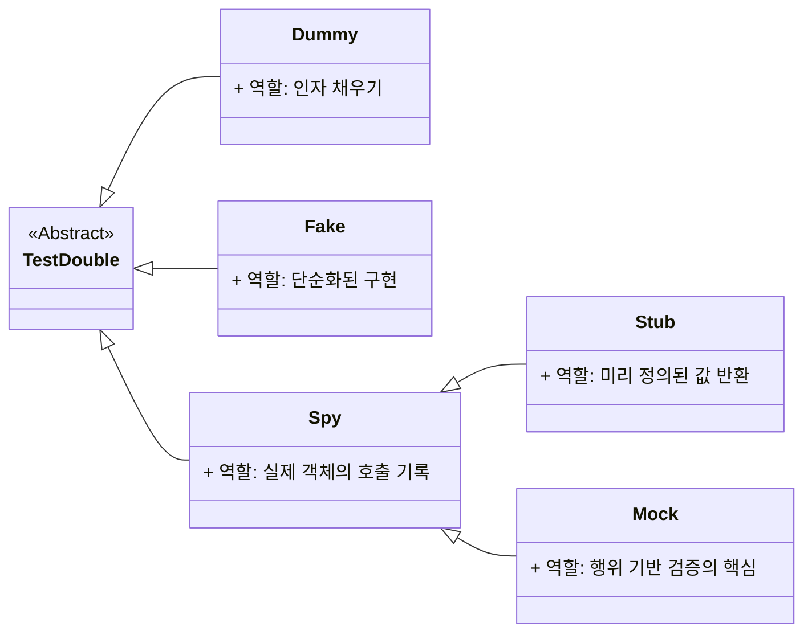

# mockito 라이브러리

유닛 테스트를 작성할 때, 테스트 대상 객체(SUT, System Under Test)가 의존하는 외부 객체(Dependency)를 실제 객체 대신 가짜 객체(Mock Object)로 대체하여 테스트의 독립성과 격리성을 보장하는 역할을 합니다.

## Mockito 가 필요한 상황

- 외부 의존성 차단
   : 테스트 대상 메소드가 데이터베이스 접근, 외부 API 호출, 파일 I/O 등 느리거나 불안정하거나 부수 효과(Side Effect)가 있는 외부 시스템에 의존할 때, Mockito는 이 의존성을 차단합니다.
- 특정 상황 재현
  : 실제 환경에서는 재현하기 어려운 특정 예외 상황이나 복잡한 반환 값(예: API 호출 실패)을 Mock 객체를 통해 쉽게 가짜로 주입하여 테스트할 수 있습니다.
- 행위 검증 (Behavior Verification)
    : 테스트 대상 객체가 Mock 객체의 특정 메소드를 정확히 몇 번 호출했는지, 어떤 인자(Argument)로 호출했는지 등을 검증할 수 있습니다.

## Double

Mockito는  Double을 다루는 프레임워크입니다. 

- Double : 대신 수행하는 것. stunt man을 stunt double 이라고도 합니다.
- Dummy : 단순히 자리만 채워넣는 것. JUnit 의 `anything()`
- Stub : 결과값을 정해놓고 검증
- Mock : 행위를 검증
- Spy : Mock + Stub
- Fake : 가짜객체를 실제와 가깝게 구현하여 검증

## [⁉️ 실습 하기 (click)](06.04-실습%20mockito%20라이브러리.md)
