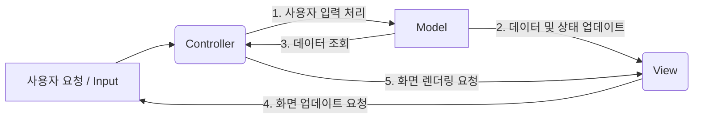
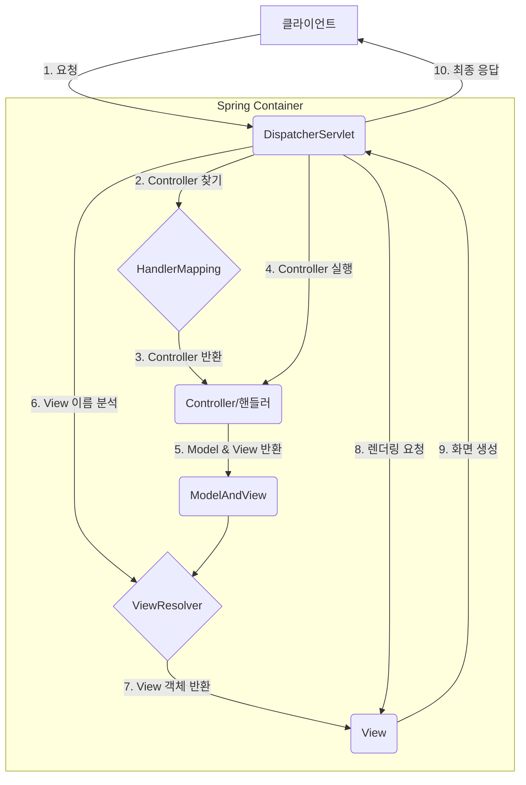
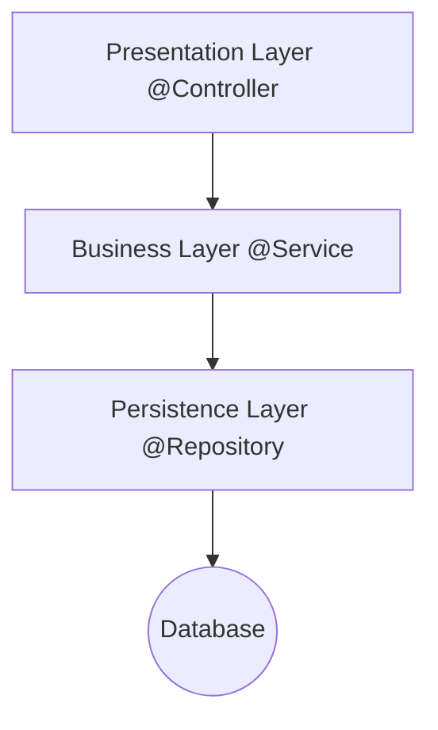

# 스프링 mvc

Spring MVC (Model-View-Controller)는 Spring Framework에서 웹 애플리케이션 및 RESTful API를 구축하는 데 사용되는 Servlet Stack 기반의 웹 프레임워크입니다. MVC 디자인 패턴을 충실히 구현하여 웹 요청 처리를 구조화하고, 각 구성요소의 역할을 분리하여 유지보수성과 확장성을 높입니다.

## MVC 패턴

(몰라도 됩니다)

- Model: 핵심 비즈니스 로직, 데이터 관리
- View: 사용자에게 데이터 표시 (UI)
- Controller: 요청을 받아 Model과 View 연결

## 핵심 구성요소의 동작 흐름

(몰라도 되지만 한번쯤 다시 보게 될 것입니다)

## Layered Architecture : DDD(Domain-Driven Design) 

(가장 중요))

- Presentation Layer : Controller
- Application Layer : Service
- Domain Layer : Entity, Value Object
- Infrastructure Layer : Repository, Datasource

## RESTful

RESTful이란 REST(Representational State Transfer) 아키텍처 스타일을 따르는 시스템을 일컫는 용어입니다. 웹의 기존 인프라(HTTP 프로토콜)를 최대한 활용하여 효율적인 웹 서비스 통신을 목표로 합니다.

- 예시

    | HTTP 메소드 | 목적 (행위)             | RESTful URI 예시 |
    | ----------- | ----------------------- | ---------------- |
    | GET         | 자원 조회 (Read)        | /users/100       |
    | POST        | 자원 생성 (Create)      | /users           |
    | PUT         | 자원 전체 갱신 (Update) | /users/100       |
    | DELETE      | 자원 삭제 (Delete)      | /users/100       |

## [⁉️ 실습 하기 (click)](07.02-실습%20스프링%20mvc.md)