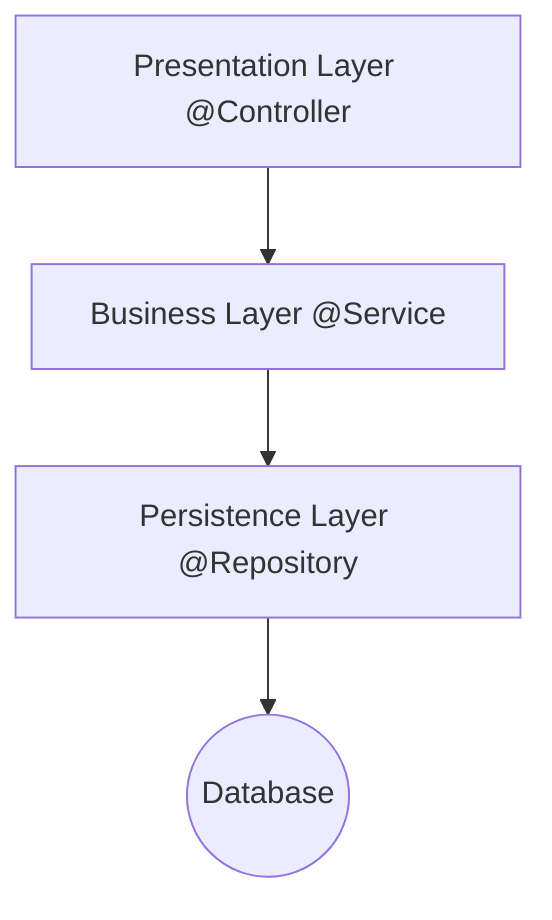

# 테스트코드 작성하며 개발하기

## 슬라이스 테스트 (Slice Test)

슬라이스 테스트(Slice Test)는 스프링 부트 애플리케이션의 특정 계층(Layer)만을 독립적으로 떼어내어 테스트하는 기법입니다. 이는 <u>유닛 테스트(Unit Test)와 통합 테스트(Integration Test)의 중간 단계</u>에 해당하며, 테스트의 속도와 격리성을 높이는 것이 주된 목적입니다.

슬라이스 테스트는 스프링 부트가 제공하는 특정 어노테이션을 사용하여, 애플리케이션의 모든 빈(Bean)을 로드하는 대신, <u>테스트 대상 계층에 관련된 최소한의 빈만 로드하도록 설정</u>합니다.

## Layered Architecture 복습



## 주요 슬라이스 테스트 어노테이션 

| 어노테이션     | 테스트 계층                     | 설명                                                                                                                                                                                   |
| -------------- | ------------------------------- | -------------------------------------------------------------------------------------------------------------------------------------------------------------------------------------- |
| @WebMvcTest    | Presentation Layer (웹 계층)    | "Controller를 테스트할 때 사용합니다. Service, Repository 등의 계층은 로드하지 않고, MockMvc 객체를 사용하여 HTTP 요청 및 응답을 모의(Mock)로 처리합니다."                             |
| @DataJpaTest   | Persistence Layer (데이터 계층) | "JPA Repository를 테스트할 때 사용합니다. 인메모리 데이터베이스(H2 등)를 자동으로 설정하고, JPA 관련 빈(EntityManager, DataSource 등)만 로드합니다. Service 계층은 로드하지 않습니다." |
| @DataMongoTest | Persistence Layer (MongoDB)     | MongoDB 관련 빈만 로드합니다.                                                                                                                                                          |
| @JsonTest      | JSON 직렬화/역직렬화            | ObjectMapper 객체를 사용하여 DTO와 JSON 간의 변환을 테스트할 때 사용합니다.                                                                                                            |

## Controller 슬라이스 테스트 예시

```java
// User.java (간결하게 가정)
public record User(Long id, String username) {}

// UserService.java (의존성)
public class UserService {
    public User findUser(Long id) {
        // ... 실제 로직 ...
        return new User(id, "RealUser");
    }
}

// UserController.java (테스트 대상)
@RestController
@RequestMapping("/users")
public class UserController {
    private final UserService userService;

    public UserController(UserService userService) {
        this.userService = userService;
    }

    @GetMapping("/{id}")
    public User getUser(@PathVariable Long id) {
        return userService.findUser(id);
    }
}
```

```java
import org.springframework.beans.factory.annotation.Autowired;
import org.springframework.boot.test.autoconfigure.web.servlet.WebMvcTest;
import org.springframework.boot.test.mock.mockito.MockitoBean; 
import org.springframework.test.web.servlet.client.MockMvcTester;
import org.junit.jupiter.api.Test;

import static org.mockito.Mockito.when;
import static org.springframework.test.web.servlet.result.MockMvcResultHandlers.print;
import static org.assertj.core.api.Assertions.assertThat;


@WebMvcTest(UserController.class) // UserController가 존재한다고 가정
public class UserControllerSliceTest {

    @Autowired 
    private MockMvcTester mockMvcTester; 

    @MockitoBean 
    private UserService userService; 

    @Test
    void testGetUserInfo_ShouldReturnCorrectUsername() throws Exception {
        // Arrange (준비)
        String username = "matthew";
        UserInfo expectedUserInfo = new UserInfo(username);
        
        // Mocking: 서비스가 호출될 때 Mock 객체 반환 설정
        when(userService.findUser(username)).thenReturn(expectedUserInfo);

        // Act & Assert (실행 및 AssertJ 검증)
        mockMvcTester.get().uri("/user/userInfo/{username}", username)
            .contentType(MediaType.APPLICATION_JSON) // Request Header 설정
            
            // 1. assertThat()으로 AssertJ 검증 체인 시작
            .assertThat() 
                // 2. MockMvc 결과 출력 (디버깅 용)
                .apply(print()) 
                // 3. 상태 코드 검증 (AssertJ 스타일)
                .hasStatusOk() 
                // 4. JSON 본문 검증 시작
                .bodyJson()
                    // 5. JSONPath를 사용하여 특정 필드 추출
                    .extractingPath("$.data.username") 
                    // 6. AssertJ의 isEqualTo()로 값 검증
                    .isEqualTo(username); 
    }
}
```

## [⁉️ 실습 하기 (click)](07.03-실습%20테스트코드%20작성하며%20개발하기.md)