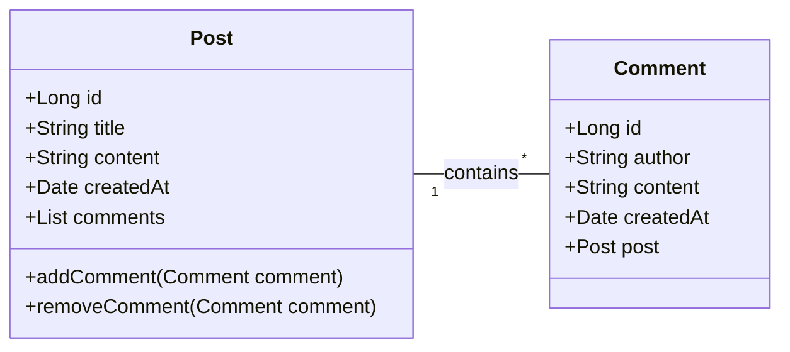

# 테스트코드 작성하며 개발하기

## 실습

### 실습 1) @Controller 슬라이스 테스트 

- 다음의 Post class 다이어그램을 참고하여 Post rest api를 작성하고 controller에 대한 테스트 코드를 작성하시오.
- 구현사항
  - 데이터베이스는 사용하지 않음
  - CRUD 를 모두 구현해야함
  - REST 규칙을 최대한 사용하시오. Method, URL

| 구성 요소                          | 설명                                                                                                                                                                                                                                                                                                                  |
| ---------------------------------- | --------------------------------------------------------------------------------------------------------------------------------------------------------------------------------------------------------------------------------------------------------------------------------------------------------------------- |
| Post 클래스                        | 게시글 정보를 나타냅니다.  - id, title, content, createdAt: 게시글의 기본 속성입니다.   - comments: List<Comment>: 이 Post에 달린 Comment 객체들의 리스트를 가집니다. 이는 일대다 관계의 "다(Many)" 쪽을 참조하는 속성입니다.   - addComment(), removeComment(): Comment를 추가하거나 제거하는 메소드입니다. |
| Comment 클래스                     | 댓글 정보를 나타냅니다. - id, author, content, createdAt: 댓글의 기본 속성입니다.   - post: Post: 이 Comment가 어떤 Post에 속하는지 참조하는 속성입니다. 이는 일대다 관계의 "일(One)" 쪽을 참조합니다.                                                                                                          |
| Post "1" -- "*" Comment : contains | Post와 Comment 간의 관계를 나타냅니다.   - "1": Post는 Comment에 대해 "하나"의 관계를 가집니다.   - "*": Comment는 Post에 대해 "다수"의 관계를 가집니다 (즉, 하나의 게시글에 여러 댓글이 달릴 수 있습니다).   - : contains: 관계의 의미를 "포함하다"로 설명합니다.                                           |

### 실습 2) TDD

- 테스트코드를 먼저 작성해가면서 코드를 완성하는 개발방법을 TDD(Test Driven Development)라고 합니다. 
- TDD의 장단점을 분석하고 실무에서 TDD로 개발하는 것에 대한 제약을 설명하시오. (hint 개발공정)