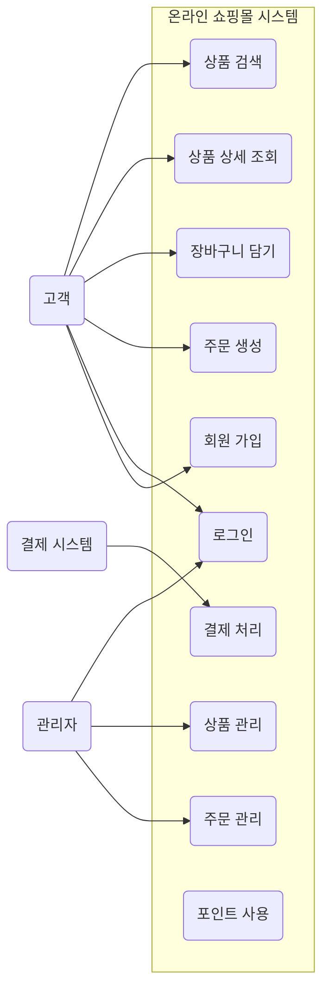
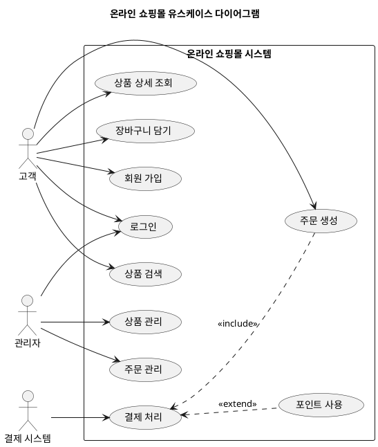

# Usecase Diagram

유스케이스 다이어그램(Usecase Diagram)은 시스템의 기능적 요구사항을 시각적으로 모델링하는 데 사용되는 UML(Unified Modeling Language) 다이어그램의 한 종류입니다.

이 다이어그램은 시스템이 사용자(액터)에게 어떤 기능을 제공하는지를 보여주며, 시스템의 경계(Scope)와 주요 기능(유스케이스)을 간략하게 파악하는 데 매우 효과적입니다.

## 유스케이스 다이어그램의 목적

  - 시스템 범위 정의: 시스템이 무엇을 할지, 무엇을 하지 않을지 명확하게 정의합니다.
  - 사용자 관점: 사용자가 시스템과 어떻게 상호작용하는지, 어떤 기능을 기대하는지 보여줍니다.
  - 쉬운 이해: 비기술적인 이해관계자(고객, 비즈니스 분석가)도 시스템의 주요 기능을 쉽게 이해할 수 있도록 돕습니다.
  - 요구사항 분석의 시작점: 상세한 기능 정의로 넘어가기 전, 큰 그림을 그리는 데 활용됩니다.

## 주요 구성 요소

유스케이스 다이어그램은 크게 세 가지 핵심 요소로 구성됩니다.

| 구성 요소                     | 설명                                                                                     |
| :---------------------------- | :--------------------------------------------------------------------------------------- |
| 액터 (Actor)                  | 시스템과 상호작용하는 외부 엔티티 (사람, 다른 시스템). 항상 시스템 외부에 존재합니다.    |
| 유스케이스 (Use Case)         | 시스템이 액터에게 제공하는 하나의 완전한 기능을 나타냅니다. 동사+명사 형태로 작성됩니다. |
| 시스템 경계 (System Boundary) | 시스템의 범위를 나타내는 사각형 상자. 유스케이스는 이 경계 안에 위치합니다.              |
| 관계 (Relationship)           | 액터와 유스케이스 간의 상호작용 또는 유스케이스 간의 확장/포함 관계를 나타냅니다.        |

## 관계의 종류

유스케이스 간에는 특정 관계를 나타낼 수 있습니다.

  - 포함 (Include): 하나의 유스케이스가 다른 유스케이스의 기능을 필수적으로 포함할 때 사용됩니다. (재사용성)
      - 예: `(주문 생성) <-- (결제 처리)` (주문 생성 시 반드시 결제 처리가 포함됨)
  - 확장 (Extend): 하나의 유스케이스가 특정 조건 하에 다른 유스케이스의 기능을 선택적으로 확장할 때 사용됩니다.
      - 예: `(결제 처리) <. (포인트 사용)` (결제 처리 중 사용자가 원하면 포인트 사용 기능이 추가될 수 있음)

## 예시

## 실습