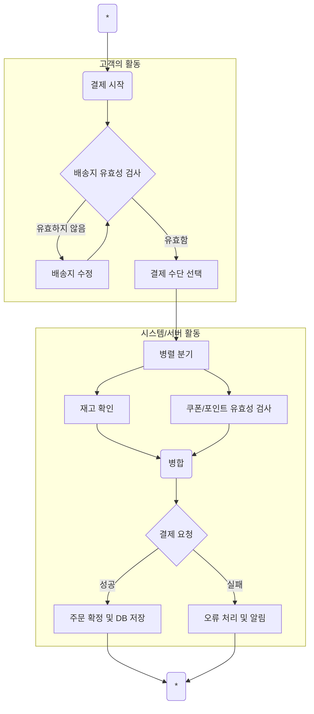
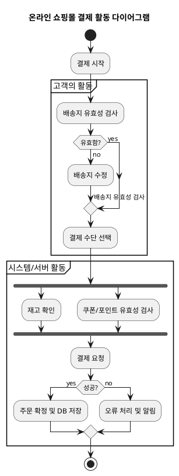

# Activity Diagram

활동 다이어그램(Activity Diagram)은 시스템 내의 절차적 흐름(Procedural Flow), 작업(Activity)의 순서, 그리고 조건에 따른 분기(Branching)를 모델링하는 데 사용되는 UML(Unified Modeling Language) 다이어그램입니다.

이는 특정 기능이나 비즈니스 프로세스가 시작부터 끝까지 어떻게 흘러가는지, 그리고 어떤 작업이 병렬적으로 수행될 수 있는지를 보여주는 플로우차트(Flowchart)와 유사합니다.

## 주요 목적

  - 프로세스 모델링: 비즈니스 프로세스나 복잡한 알고리즘의 단계를 시각화합니다.
  - 병렬 처리: 여러 활동이 동시에 수행되는 병렬 처리(Concurrency) 부분을 명확히 나타낼 수 있습니다.
  - 제어 흐름: 데이터 흐름이 아닌, 작업의 제어 흐름이 어떻게 이동하는지를 중점적으로 보여줍니다.

## 주요 구성 요소

| 구성 요소                    | 설명                                                                                                |
| :--------------------------- | :-------------------------------------------------------------------------------------------------- |
| 시작 노드 (Initial Node)     | 활동 흐름의 시작 지점을 나타내는 채워진 작은 원.                                                    |
| 활동 (Activity Node)         | 시스템이나 프로세스가 수행하는 특정 작업이나 단계를 나타내는 둥근 사각형.                           |
| 종료 노드 (Final Node)       | 활동 흐름의 종료 지점을 나타내는 이중 원.                                                           |
| 흐름/전이 (Edge)             | 한 활동에서 다음 활동으로의 제어 이동을 나타내는 화살표.                                            |
| 결정 노드 (Decision Node)    | 흐름이 조건에 따라 분기되는 지점. 마름모꼴로 표시됩니다.                                            |
| 합류 노드 (Merge Node)       | 결정 노드에 의해 분기되었던 흐름이 다시 합쳐지는 지점. 마름모꼴로 표시됩니다.                       |
| 분할/동기화 (Fork/Join)      | 흐름을 병렬로 나누거나(Fork), 나누어졌던 병렬 흐름이 모두 완료되기를 기다렸다가 합치는 (Join) 지점. |
| 구획/풀 (Swimlane/Partition) | 활동을 수행하는 주체(액터, 부서, 시스템 컴포넌트)를 시각적으로 구분하는 영역.                       |

## 예시

## 실습