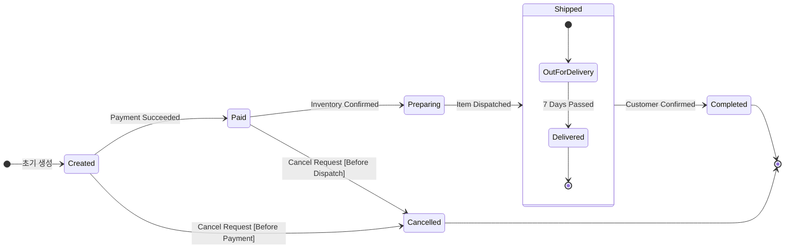
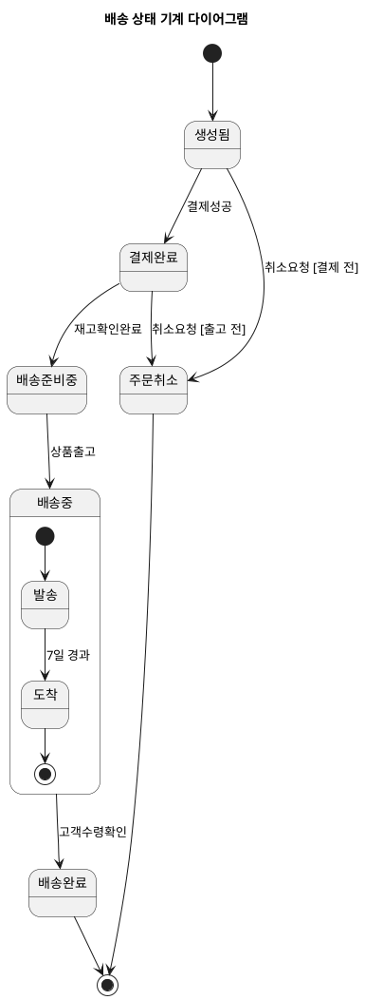

# State machine Diagram

상태 기계 다이어그램(State Machine Diagram)은 시스템, 객체, 또는 프로세스가 외부 이벤트에 반응하여 시간이 지남에 따라 어떻게 상태를 바꾸는지를 모델링하는 데 사용되는 UML(Unified Modeling Language) 다이어그램입니다.

과거에는 상태 전이 다이어그램(State Transition Diagram)으로 불렸으며, 주로 복잡한 시스템의 행위(Behavior)나 단일 객체의 생명주기를 명확하게 보여주는 데 초점을 맞춥니다.

## 주요 목적

  * 동작 모델링: 객체가 다양한 상황에서 어떻게 행동하고 응답하는지 보여줍니다.
  * 제어 흐름: 복잡한 조건이나 이벤트에 따른 시스템의 제어 흐름을 명확하게 파악할 수 있습니다.
  * 유효성 검증: 특정 상태에 도달하기 위해 거쳐야 하는 경로(Path)를 검증하는 데 유용합니다.

## 주요 구성 요소

| 구성 요소                     | 설명                                                                        |
| ----------------------------- | :-------------------------------------------------------------------------- |
| 상태 (State)                  | 시스템이나 객체가 특정 시점에 처해 있는 조건이나 상황.                      |
| 시작 상태                     | 프로세스 또는 객체의 시작 지점. 항상 하나만 존재합니다.                     |
| 종료 상태                     | 프로세스 또는 객체의 종료 지점. 여러 개 있을 수 있습니다.                   |
| 전이 (Transition)             | 한 상태에서 다른 상태로 이동하는 흐름.                                      |
| 이벤트/트리거 (Event/Trigger) | 전이(Transition)를 발생시키는 조건이나 외부 신호.                           |
| 활동 (Activity)               | 상태에 진입할 때(Entry), 머무는 동안(Do), 또는 나갈 때(Exit) 수행되는 동작. |

## 예시

온라인 주문 상품의 배송 상태 변화를 모델링하는 상태 기계 다이어그램 예시입니다.

## 실습