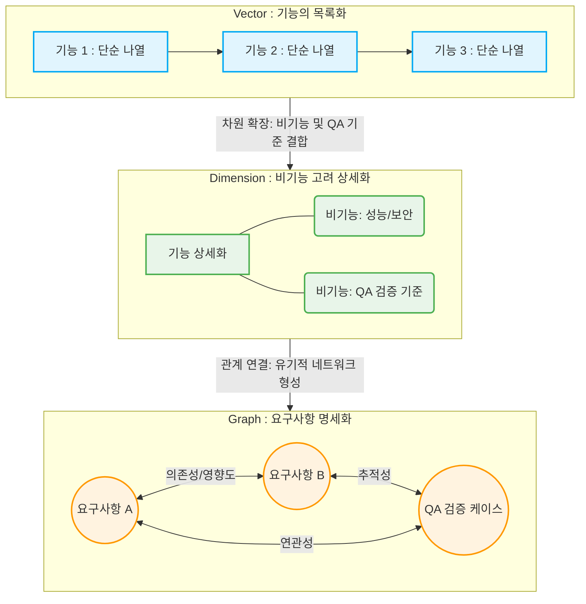

# Requirement Documents

요구사항 문서(Requirement Document)는 특정 시스템, 소프트웨어, 또는 제품이 무엇을 해야 하는지(What), 어떻게 작동해야 하는지(How), 그리고 어떤 제약 조건을 충족해야 하는지를 공식적으로 기록한 문서입니다. 이 문서는 프로젝트의 모든 이해관계자(Stakeholders) 사이에서 합의된 공통의 기준점 역할을 합니다.

일반적으로 요구사항 문서는 SRS (Software Requirement Specification)라는 이름으로 가장 많이 불립니다.

## 요구사항 문서의 주요 목적

요구사항 문서는 프로젝트의 초기 단계에서 정의되며, 프로젝트 성공에 필수적인 역할을 합니다.

- 소통 및 합의: 개발팀, 고객, 관리자 등 모든 이해관계자가 시스템에 대한 동일한 이해를 가지도록 보장합니다.
- 개발의 기준: 개발팀이 시스템을 구축하기 위한 명확한 목표와 기능을 제공합니다.
- 테스트의 기준: QA(품질 보증) 팀이 시스템이 요구사항대로 정확하게 작동하는지 테스트할 기준을 제공합니다.
- 변경 관리: 요구사항이 변경될 때 그 영향을 평가하고 관리하기 위한 공식적인 근거를 제공합니다.

## 요구사항의 주요 분류

요구사항은 일반적으로 기능과 품질/제약 조건에 따라 크게 두 가지 유형으로 분류됩니다.

### 기능적 요구사항 (Functional Requirements)

시스템이 무엇을 해야 하는가를 정의합니다. 사용자에게 직접 제공되는 기능 및 동작과 관련됩니다.

- 예시: "사용자는 상품을 장바구니에 담을 수 있어야 한다." "시스템은 비밀번호를 해시 암호화하여 저장해야 한다."

### 비기능적 요구사항 (Non-Functional Requirements)

시스템이 얼마나 잘 작동해야 하는가(품질)와 관련된 성능, 보안, 사용성, 제약 조건 등을 정의합니다. 이는 시스템의 품질 속성(Quality Attributes)입니다.

| 유형                   | 설명                              | 예시                                                 |
| :--------------------- | :-------------------------------- | :--------------------------------------------------- |
| 성능 (Performance)     | 응답 시간, 처리량, 동시 사용자 수 | "모든 API 요청은 2초 이내에 응답해야 한다."          |
| 보안 (Security)        | 인증, 접근 제어, 데이터 암호화    | "사용자 비밀번호는 BCrypt 방식으로 저장해야 한다."   |
| 사용성 (Usability)     | 학습 용이성, 인터페이스의 직관성  | "로그인 페이지는 3단계 이내로 완료되어야 한다."      |
| 운영/배포 (Deployment) | 백업, 모니터링, 유지보수성        | "시스템은 Docker 컨테이너 환경에서 배포되어야 한다." |

## SRS 문서의 일반적인 구성

표준화된 SRS 문서(IEEE 830 표준 등)는 다음과 같은 주요 섹션을 포함합니다.

- 소개 (Introduction): 문서의 목적, 범위, 용어 정의.
- 전반적인 설명 (Overall Description): 시스템의 개요, 사용자 특성, 제품 기능 개요, 운영 환경 등.
- 구체적인 요구사항 (Specific Requirements):
    - 기능적 요구사항: 시스템의 모든 기능 목록 및 상세 설명.
    - 비기능적 요구사항: 성능, 보안, 품질, 제약 조건 등.
- 부록 (Appendix): 참조 자료, 추가 다이어그램(예: UML 다이어그램).

## 실습

### 실습 1) 
IEEE 830에 대해 조사하시오.

### 실습 2) 
요구사항은 기능적 요구사항과 비기능적 요구사항으로 분류될 수 있다. 기능의 동작은 시스템 사용자가, 시스템의 동작은 개발자가 가장 잘 아는 분야일 것이다. 그렇다면 시스템 사용자와 개발자가 소통과 합의를 하면 요구사항이 도출될 것으로 보인다. 하지만 다수의 요구사항이 개발 진행 중에 잦은 변경사항이 발생하는데 단순히 소통의 문제로 볼 것인지, 아니면 이 상황이 요구사항 문서의 주요목적에 부합하지 않는 부분이 존재하는 것인지에 대한 자유로운 의견을 서술하시오. 

---

## 요구사항을 명세화하는 과정 (실습 2에 대한 샘플 답변)

## 요약 목록

* **Vector (벡터)**: 요구사항을 단순 나열한 기능의 목록화 단계 (방향성과 항목 정의).
* **Dimension (차원)**: 비기능적 요소를 결합하여 다각도로 요구사항을 구체화하는 단계 (품질 및 제약사항 추가).
* **Graph (그래프)**: 요구사항 간의 연결 관계, 의존성, 추적 가능성을 연결하여 명세화하는 최종 단계 (유기적 네트워크 형성).

요구사항 명세화 과정을 선형적인 목록(**Vector**)에서 다각적 상세화(**Dimension**), 그리고 유기적인 관계망(**Graph**)으로 확장해 나가는 관점은 복잡한 요구사항의 진화 과정을 수학적·구조적 메타포로 명확하게 표현한 훌륭한 시각입니다.

요청하신 흐름을 직관적으로 이해할 수 있도록 구조화한 Mermaid 다이어그램입니다.

## 단계별 흐름의 의미

### 1. Vector (선형적 목록화)

* **특징**: 단순히 사용자가 원하는 기능들을 1차원적인 리스트로 나열한 상태입니다.
* **비유**: 시작점과 끝점, 그리고 무엇을 해야 하는지라는 최소한의 '방향성'만 가진 상태를 뜻합니다.

### 2. Dimension (입체적 상세화)

* **특징**: 단순한 기능 목록에 비기능적 요구사항(성능, 보안, 가용성)과 앞서 강조하신 'QA 검증 기준'이 결합하면서 요구사항이 입체적인 두께를 갖게 됩니다.
* **비유**: 선(Vector)들이 모여 면과 공간(Dimension)을 이루듯, 하나의 기능이 시스템에서 어떻게 안전하고 명확하게 동작하고 검증되어야 하는지 다각도로 구체화되는 단계입니다.

### 3. Graph (유기적 명세화)

* **특징**: 개별적으로 상세화된 요구사항들이 서로 어떤 영향을 주고받는지(의존성), 그리고 최종 테스트 케이스와 어떻게 연결되는지(추적성) 그 관계망을 완성하는 최종 명세화 단계입니다.
* **비유**: 점과 점이 선으로 연결되어 거대한 네트워크(Graph)를 이루듯, 요구사항 변경 시 어느 부분이 영향을 받는지 한눈에 파악할 수 있는 살아있는 명세서의 상태를 의미합니다.

---
---

## 요구사항 명세화 과정을 적용했을때 대면 회의에 대한 생산성 효과 분석
## 요약 목록

- **핵심 결론**: 대면 회의가 획기적으로 줄어드는 것이 맞습니다. 명세화(Vector → Dimension → Graph)가 잘된 프로젝트일수록 '정보 전달' 목적의 회의가 사라집니다.
    
- **회의의 질적 변화**: 회의의 전체 빈도는 감소하고, 회의의 성격이 '모호함을 해결하기 위한 논쟁'에서 '의사결정을 위한 협의'로 고도화됩니다.
    
- **주의점**: 대면 회의가 줄어드는 대신, 요구사항 문서(또는 이슈 트래커)를 통한 비동기식(Asynchronous) 리뷰와 피드백 활동이 그 자리를 대체하게 됩니다.
    

요구사항을 명세화하는 과정을 거치면 **불필요한 대면 회의를 상당 부분 줄일 수 있으며, 남아있는 회의의 효율성도 극대화**됩니다.

구체적으로 어떤 기전(Mechanism)을 통해 회의가 줄어드는지, 그리고 회의의 성격이 어떻게 변하는지 검토한 결과는 다음과 같습니다.

## 1. 줄어드는 '불필요한' 대면 회의의 종류

명세화가 제대로 되지 않았을 때 발생하는 회의들은 대부분 '싱크(Sync) 맞추기'나 '말꼬리 잡기'식 회의입니다. 명세화 과정은 이를 원천 차단합니다.

- **"그때 말한 게 이게 맞나요?" 회의 (확인성 회의 소멸)**
    
    - 사용자와 개발자가 구두로만 합의하면 서로 다르게 기억하기 때문에 끊임없이 재확인 회의를 해야 합니다. 하지만 명세화 단계를 거치면 문서가 유일한 진실의 원천(Single Source of Truth)이 되므로, 확인만을 위한 호출이 사라집니다.
        
- **"이렇게 만들면 테스트 어떻게 하죠?" 회의 (QA-개발자 갈등 회의 소멸)**
    
    - **Dimension(차원)** 단계에서 비기능 요구사항과 QA 검증 기준이 이미 확정되었기 때문에, 구현 도중이나 구현 직후에 개발자와 QA 담당자가 모여 "이게 패스냐 실패냐"를 두고 대면으로 논의할 필요가 없어집니다.
        
- **"이거 고치면 어디가 망가지나요?" 회의 (영향도 분석 회의 소멸)**
    
    - **Graph(그래프)** 단계에서 요구사항 간의 연결 관계와 의존성이 시각화되어 있다면, 특정 요구사항이 변경될 때 영향을 받는 범위가 자동으로 도출됩니다. 따라서 모여서 머리를 맞대고 추측성 회의를 할 필요가 없습니다.
        

## 2. 대면 회의의 '질적 변화' (통제에서 협업으로)

회의의 총량이 줄어드는 것보다 더 중요한 것은 **회의의 성격이 건강하게 변한다는 점**입니다.

|**구분**|**명세화 전의 대면 회의**|**명세화 후의 대면 회의**|
|---|---|---|
|**주요 목적**|오해 해소, 감정적 책임 공방, 정보 전달|변경의 가치 판단, 우선순위 조율, 의사결정|
|**회의 자료**|각자의 기억, 불완전한 메모|명확한 기준과 추적성이 확보된 명세서(Graph)|
|**참석자 태도**|방어적 (덤터기를 쓰지 않기 위함)|생산적 (비즈니스 가치에 집중)|

기준과 책임 소재가 명확한 상태(Graph 단계)에서는 변경이 발생하더라도 대면 회의가 길어지지 않습니다. "이 변경을 반영하면 QA 기준이 이렇게 바뀌고, 의존성에 의해 B 기능도 수정해야 하니 3일이 더 소요됩니다. 진행할까요?"라는 **데이터 기반의 짧고 명확한 의사결정 회의**만 남게 됩니다.

## 3. 검토 시 유의할 점: 비동기 소통의 증가

대면 회의가 줄어든다고 해서 소통의 총량이 줄어드는 것은 아닙니다.

대면 회의(동기식 소통)가 줄어드는 대신, 명세화된 텍스트나 모델을 보고 의견을 남기는 **비동기식(Asynchronous) 소통**이 늘어납니다.

- 개발자, 사용자, QA가 한 자리에 모여 1시간 동안 말로 떠드는 대신, 잘 정리된 요구사항 문서나 지라(Jira) 티켓 위에 덧글로 검증 기준을 정교화하는 과정이 자리 잡게 됩니다.
    
- 이는 전화를 거는 대신 메시지를 남기는 것과 같아서, 각자 업무 흐름(Context)이 끊기지 않는 상태에서 집중할 수 있어 조직 전체의 생산성이 극대화됩니다.
    

## 결론

작성하신 **Vector → Dimension → Graph**의 흐름대로 요구사항이 명세화되면, 기존에 개발 현장을 괴롭히던 "말이 달라서", "기준이 없어서" 모여야 했던 불필요한 대면 회의는 **확실하게 제거**됩니다.

명세화는 단순히 문서를 만드는 작업이 아니라, **조직의 소통 비용을 효율화하고 감정 소모를 줄이는 가장 확실한 엔지니어링 가치**를 지닙니다.