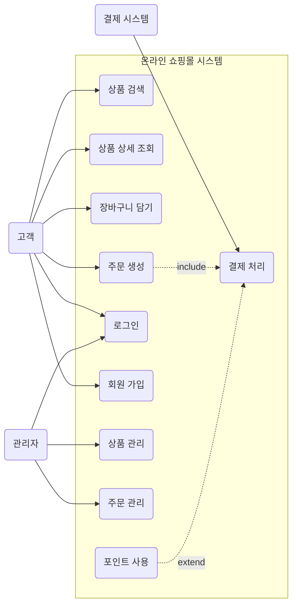
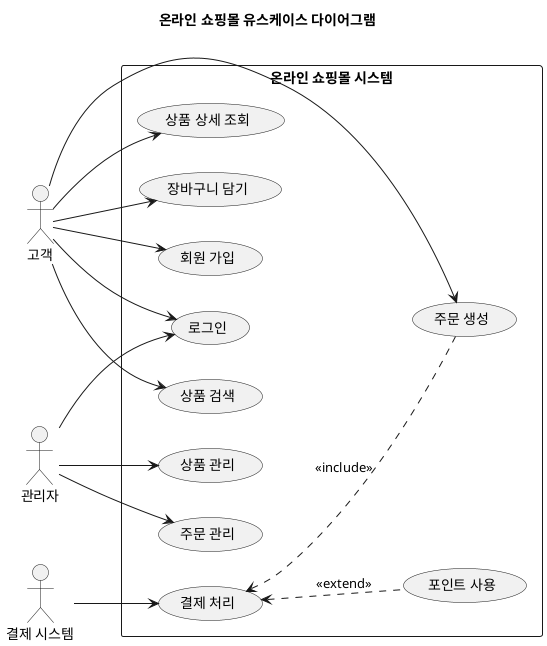

# Usecase Diagram

유스케이스 다이어그램(Usecase Diagram)은 시스템의 기능적 요구사항을 시각적으로 모델링하는 데 사용되는 UML(Unified Modeling Language) 다이어그램의 한 종류입니다.

이 다이어그램은 시스템이 사용자(액터)에게 어떤 기능을 제공하는지를 보여주며, 시스템의 경계(Scope)와 주요 기능(유스케이스)을 간략하게 파악하는 데 매우 효과적입니다.

## 유스케이스 다이어그램의 목적

  - 시스템 범위 정의: 시스템이 무엇을 할지, 무엇을 하지 않을지 명확하게 정의합니다.
  - 사용자 관점: 사용자가 시스템과 어떻게 상호작용하는지, 어떤 기능을 기대하는지 보여줍니다.
  - 쉬운 이해: 비기술적인 이해관계자(고객, 비즈니스 분석가)도 시스템의 주요 기능을 쉽게 이해할 수 있도록 돕습니다.
  - 요구사항 분석의 시작점: 상세한 기능 정의로 넘어가기 전, 큰 그림을 그리는 데 활용됩니다.

## 주요 구성 요소

유스케이스 다이어그램은 크게 세 가지 핵심 요소로 구성됩니다.

| 구성 요소                     | 설명                                                                                     |
| :---------------------------- | :--------------------------------------------------------------------------------------- |
| 액터 (Actor)                  | 시스템과 상호작용하는 외부 엔티티 (사람, 다른 시스템). 항상 시스템 외부에 존재합니다.    |
| 유스케이스 (Use Case)         | 시스템이 액터에게 제공하는 하나의 완전한 기능을 나타냅니다. 동사+명사 형태로 작성됩니다. |
| 시스템 경계 (System Boundary) | 시스템의 범위를 나타내는 사각형 상자. 유스케이스는 이 경계 안에 위치합니다.              |
| 관계 (Relationship)           | 액터와 유스케이스 간의 상호작용 또는 유스케이스 간의 확장/포함 관계를 나타냅니다.        |

## 관계의 종류

유스케이스 간에는 특정 관계를 나타낼 수 있습니다.

  - 포함 (Include): 하나의 유스케이스가 다른 유스케이스의 기능을 필수적으로 포함할 때 사용됩니다. (재사용성)
      - 예: `(주문 생성) <-- (결제 처리)` (주문 생성 시 반드시 결제 처리가 포함됨)
  - 확장 (Extend): 하나의 유스케이스가 특정 조건 하에 다른 유스케이스의 기능을 선택적으로 확장할 때 사용됩니다.
      - 예: `(결제 처리) <. (포인트 사용)` (결제 처리 중 사용자가 원하면 포인트 사용 기능이 추가될 수 있음)

## 예시

## 실습

### 실습 1)
유스케이스 다이어그램에서는 '흐름(flow)'을 표시하지 않는 이유를 설명하시오. 

---

## 유스케이스 다이어그램에서 '흐름(Flow)'를 표시하지 않는 이유

## 요약 목록

* **핵심 이유**: 유스케이스 다이어그램은 시스템의 '무엇(What)'을 표현하는 ==정적 모델==이며, '어떻게(How)'나 '어떤 순서(When)'를 표현하는 동적 모델이 아니기 때문입니다.
* **표현의 한계**: 흐름(시간적 순서, 조건 분기 등)을 표시하기 시작하면 다이어그램이 지나치게 복잡해져, '시스템의 범위와 기능 시각화'라는 본연의 목적을 상실하게 됩니다.
* **대안 모델**: 실행 흐름이나 순서는 ==액티비티 다이어그램==(Activity Diagram)이나 ==시퀀스 다이어그램==(Sequence Diagram)을 통해 표현하는 것이 UML 표준 원칙입니다.

---

유스케이스 다이어그램(Use Case Diagram)에서 흐름(Flow)이나 순서를 표시하지 않는 이유는 이 다이어그램의 **존재 목적과 설계 원칙** 때문입니다. 구체적인 이유는 다음과 같습니다.

## 1. 'What(무엇)'과 'How(어떻게)'의 분리

유스케이스 다이어그램은 시스템이 사용자에게 제공해야 하는 기능적 요구사항의 범위(Scope)와 상위 수준의 목표(What)를 보여주는 도구입니다.
사용자가 시스템을 통해 '로그인을 한다', '글을 작성한다'라는 목적 그 자체를 정의할 뿐, 로그인 성공 후 다음 화면으로 이동한다거나 비밀번호가 틀렸을 때의 예외 처리 같은 동작의 절차나 방법(How)은 다이어그램의 관심사가 아닙니다.

## 2. 정적 모델(Static Model)로서의 정체성

UML(통합 모델링 언어)은 시스템을 정적 구조와 동적 행위로 나누어 표현합니다.

* 유스케이스 다이어그램은 시스템의 구성 요소(액터)와 기능(유스케이스) 간의 관계를 보여주는 **정적(Static) 모델**에 가깝습니다.
* 여기에 시간의 흐름이나 실행 순서를 도입하면 정적 모델의 단순함이 무너지고 모델의 일관성이 깨지게 됩니다.

## 3. 다이어그램의 단순성과 가시성 유지

유스케이스 다이어그램의 가장 큰 목적은 개발자, 사용자, QA 담당자 등 **모든 이해관계자가 시스템의 전체 기능을 한눈에 직관적으로 파악**하도록 돕는 것입니다.
만약 유스케이스 사이에 화살표로 "A 기능이 끝나면 B 기능으로 간다", "조건에 따라 C로 분기한다" 같은 흐름을 표시하기 시작하면 선이 꼬이고 다이어그램이 극도로 복잡해져 소통 도구로서의 가치를 잃어버립니다.

## 4. ==흐름을 표현하기 위한 별도의 UML 도구 존재==

UML 표준은 역할이 철저히 분담되어 있습니다. 유스케이스 다이어그램에서 흐름을 표현하지 않는 대신, 흐름이 필요한 부분은 다음과 같은 별도의 다이어그램이나 문서로 표현하도록 유도합니다.

* **유스케이스 명세서 (Specification)**: 유스케이스 내부의 기본 흐름(Basic Flow), 대안 흐름(Alternative Flow)을 텍스트로 상세히 기술합니다.
* **액티비티 다이어그램 (Activity Diagram)**: 비즈니스 프로세스나 기능의 실행 순서, 조건 분기 등 '흐름'을 시각화하는 데 특화되어 있습니다.
* **시퀀스 다이어그램 (Sequence Diagram)**: 객체 간의 시간적 상호작용 순서(흐름)를 표현합니다.

## 결론

유스케이스 다이어그램에서 흐름을 제외하는 것은 표현 능력이 부족해서가 아니라, **"시스템이 제공하는 핵심 가치(기능 목록)가 무엇인가"에만 온전히 집중하여 복잡성을 통제하기 위한 의도적인 설계 원칙**입니다. <u>앞서 언급하신 단계 중 1차원적인 기능의 나열과 영역을 정의하는 **Vector** 단계의 정체성을 명확히 지키기 위함이라고 볼 수 있습니다.</u>