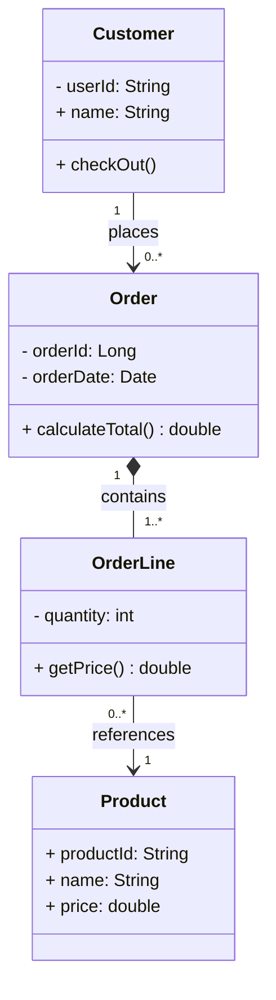
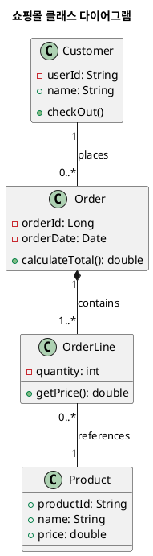

# Class Diagram

클래스 다이어그램(Class Diagram)은 객체 지향 시스템의 정적인 구조(Static Structure)를 모델링하는 데 사용되는 UML(Unified Modeling Language) 다이어그램의 가장 핵심적인 유형입니다.

이 다이어그램은 시스템을 구성하는 클래스(Class), 각 클래스의 속성(Attributes) 및 메소드(Operations), 그리고 클래스들 간의 관계(Relationships)를 시각적으로 표현합니다.

## 클래스 다이어그램의 주요 구성 요소

### 클래스 (Class)

클래스는 일반적으로 세 부분으로 나뉜 직사각형으로 표현됩니다.

| 부분 | 내용                | 설명                   |
| :--- | :------------------ | :--------------------- |
| 상단 | 클래스 이름         | `User`                 |
| 중간 | 속성 (Attributes)   | 클래스의 데이터 (변수) |
| 하단 | 메소드 (Operations) | 클래스의 동작 (함수)   |

  * 가시성(Visibility): 속성과 메소드 앞에는 접근 제한자(`public`, `private`, `protected`)를 나타내는 기호가 붙습니다.
      * `+` : Public (공개)
      * `-` : Private (비공개)
      * `#` : Protected (보호)

### 관계 (Relationships)

클래스 다이어그램에서 가장 중요한 것은 클래스 간의 연결 및 상호작용 방식입니다.

| 관계                    | 설명                                                                                                          |
| :---------------------- | :------------------------------------------------------------------------------------------------------------ |
| 연관 (Association)      | 두 클래스가 서로 관련되어 있음을 나타내는 가장 일반적인 관계입니다. (예: 직원은 부서를 가진다.)               |
| 집합 (Aggregation)      | 전체(Whole)와 부분(Part)의 관계이지만, 생명주기가 독립적일 때 사용합니다. (약한 관계)                         |
| 합성 (Composition)      | 전체와 부분의 관계이며, 부분의 생명주기가 전체에 종속됩니다. (강한 관계) (예: 건물이 파괴되면 방도 사라진다.) |
| 일반화 (Generalization) | 상속(Inheritance) 관계입니다. 한 클래스(자식)가 다른 클래스(부모)의 특징을 물려받습니다.                      |
| 실체화 (Realization)    | 한 클래스가 다른 클래스의 인터페이스(Interface)를 구현함을 나타냅니다.                                        |
| 의존 (Dependency)       | 한 클래스가 다른 클래스를 일시적으로 사용하는 관계입니다. (예: 메소드의 파라미터로 사용)                      |

## 예시

온라인 쇼핑몰의 간단한 주문 시스템 클래스 다이어그램 예시입니다.






## 실습

### 실습 1)
예시에 사용된 온라이 쇼핑몰의 간단한 주문 시스템 클래스 다이어그램을 Java 로 구현하시오.

```java
public class Customer {

    private final String userId;
    private String name;
    private final List<Order> orders = new ArrayList<>();

    public Customer(String userId, String name) {
        this.userId = userId;
        this.name = name;
    }

    public Order checkOut(List<CartItem> items) {
        Order order = Order.createOrder(items);
        this.orders.add(order);
        return order;
    }

    public String getUserId() {
        return userId;
    }

    public String getName() {
        return name;
    }

    public List<Order> getOrders() {
        return Collections.unmodifiableList(orders);
    }
}

public class Order {

    private final Long orderId;
    private final LocalDateTime orderDate;
    private final List<OrderLine> orderLines;

    private Order(Long orderId, List<OrderLine> orderLines) {
        this.orderId = orderId;
        this.orderDate = LocalDateTime.now();
        this.orderLines = new ArrayList<>(orderLines);
    }

    public static Order createOrder(List<CartItem> items) {
        if (items == null || items.isEmpty()) {
            throw new IllegalArgumentException("주문 항목이 비어있을 수 없습니다.");
        }
        
        List<OrderLine> lines = items.stream()
                .map(item -> new OrderLine(item.getProduct(), item.getQuantity()))
                .toList();
                
        // 실제 환경에서는 ID 생성 전략(Sequence, SnowFlake 등) 적용
        Long generatedId = new Random().nextLong(100000L); 
        return new Order(generatedId, lines);
    }

    public double calculateTotal() {
        return orderLines.stream()
                .mapToDouble(OrderLine::getPrice)
                .sum();
    }

    public Long getOrderId() {
        return orderId;
    }

    public LocalDateTime getOrderDate() {
        return orderDate;
    }

    public List<OrderLine> getOrderLines() {
        return Collections.unmodifiableList(orderLines);
    }
}

public class OrderLine {

    private final int quantity;
    private final Product product;

    protected OrderLine(Product product, int quantity) {
        if (quantity <= 0) {
            throw new IllegalArgumentException("수량은 1개 이상이어야 합니다.");
        }
        if (product == null) {
            throw new IllegalArgumentException("상품 정보는 필수입니다.");
        }
        this.product = product;
        this.quantity = quantity;
    }

    public double getPrice() {
        return product.getPrice() * quantity;
    }

    public int getQuantity() {
        return quantity;
    }

    public Product getProduct() {
        return product;
    }
}

public class Product {

    private final String productId;
    private String name;
    private double price;

    public Product(String productId, String name, double price) {
        if (price < 0) {
            throw new IllegalArgumentException("가격은 0원 이상이어야 합니다.");
        }
        this.productId = productId;
        this.name = name;
        this.price = price;
    }

    public void changePrice(double newPrice) {
        if (newPrice < 0) {
            throw new IllegalArgumentException("가격은 0원 이상이어야 합니다.");
        }
        this.price = newPrice;
    }

    public String getProductId() {
        return productId;
    }

    public String getName() {
        return name;
    }

    public double getPrice() {
        return price;
    }
}
public class CartItem {
    
    private final Product product;
    private final int quantity;

    public CartItem(Product product, int quantity) {
        this.product = product;
        this.quantity = quantity;
    }

    public Product getProduct() {
        return product;
    }

    public int getQuantity() {
        return quantity;
    }
}
```