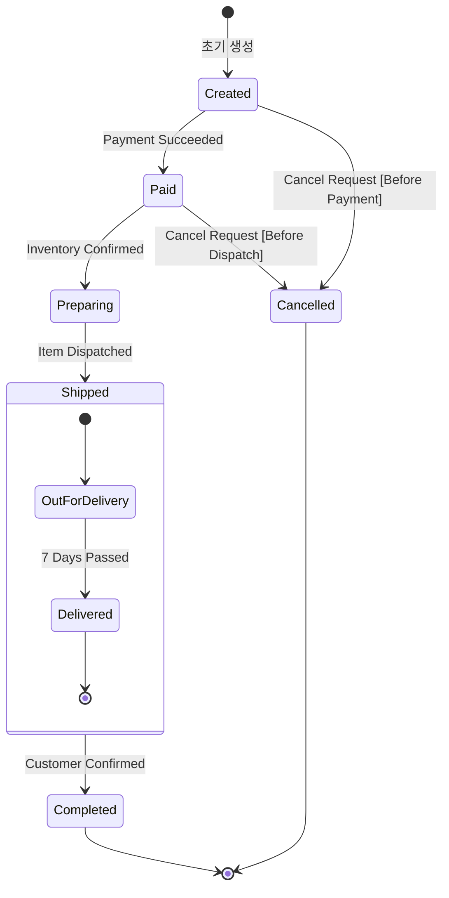
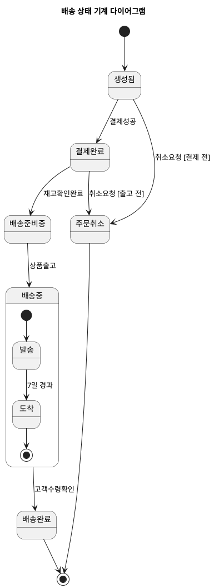

# State machine Diagram


상태 기계 다이어그램(State Machine Diagram)은 시스템, 객체, 또는 프로세스가 외부 이벤트에 반응하여 시간이 지남에 따라 어떻게 상태를 바꾸는지를 모델링하는 데 사용되는 UML(Unified Modeling Language) 다이어그램입니다.

과거에는 상태 전이 다이어그램(State Transition Diagram)으로 불렸으며, 주로 복잡한 시스템의 행위(Behavior)나 단일 객체의 생명주기를 명확하게 보여주는 데 초점을 맞춥니다.

## 주요 목적

  * 동작 모델링: 객체가 다양한 상황에서 어떻게 행동하고 응답하는지 보여줍니다.
  * 제어 흐름: 복잡한 조건이나 이벤트에 따른 시스템의 제어 흐름을 명확하게 파악할 수 있습니다.
  * 유효성 검증: 특정 상태에 도달하기 위해 거쳐야 하는 경로(Path)를 검증하는 데 유용합니다.

## 주요 구성 요소

| 구성 요소                     | 설명                                                                        |
| ----------------------------- | :-------------------------------------------------------------------------- |
| 상태 (State)                  | 시스템이나 객체가 특정 시점에 처해 있는 조건이나 상황.                      |
| 시작 상태                     | 프로세스 또는 객체의 시작 지점. 항상 하나만 존재합니다.                     |
| 종료 상태                     | 프로세스 또는 객체의 종료 지점. 여러 개 있을 수 있습니다.                   |
| 전이 (Transition)             | 한 상태에서 다른 상태로 이동하는 흐름.                                      |
| 이벤트/트리거 (Event/Trigger) | 전이(Transition)를 발생시키는 조건이나 외부 신호.                           |
| 활동 (Activity)               | 상태에 진입할 때(Entry), 머무는 동안(Do), 또는 나갈 때(Exit) 수행되는 동작. |

## 예시

온라인 주문 상품의 배송 상태 변화를 모델링하는 상태 기계 다이어그램 예시입니다.




## 실습

### 실습 1) 
다음의 5-Step Architecture의 상태 모델 스킬을 참고하여 예시의 온라인 주문 상품의 배송 상태 다이어그램을 구현하시오

[5-Step Architecture의 상태 모델 스킬](state-model-skill.md)

### 실습 2) 

skill 문서만으로 코드 생성이 가능했던 이유를 설명하시오. 

---

### 실습 1) 에 대한 결과 코드 예시

```java

public class Order {

    private final Long orderId;
    private OrderStatus status;
    private String shippingAddress;

    public Order(Long orderId, String shippingAddress) {
        this.orderId = orderId;
        this.status = new OrderStatus.Created();
        this.shippingAddress = shippingAddress;
    }

    public void trigger(OrderTransitionEvent event) {
        TransitionResult<OrderStatus, Order> result = this.status.trigger(event);
        this.status = result.status();
        result.actions().forEach(action -> action.apply(this));
    }

    public void updateShippingAddress(String shippingAddress) {
        this.shippingAddress = shippingAddress;
    }

    public Long getOrderId() {
        return orderId;
    }

    public OrderStatus getStatus() {
        return status;
    }

    public String getShippingAddress() {
        return shippingAddress;
    }
}

public sealed interface OrderTransitionEvent extends TransitionEvent<Order>
        permits OrderTransitionEvent.PaymentSucceeded,
                OrderTransitionEvent.InventoryConfirmed,
                OrderTransitionEvent.ItemDispatched,
                OrderTransitionEvent.SevenDaysPassed,
                OrderTransitionEvent.CustomerConfirmed,
                OrderTransitionEvent.CancelRequest {

    record PaymentSucceeded() implements OrderTransitionEvent {
        @Override
        public List<PostAction<Order>> actions() {
            return List.of();
        }
    }

    record InventoryConfirmed() implements OrderTransitionEvent {
        @Override
        public List<PostAction<Order>> actions() {
            return List.of();
        }
    }

    record ItemDispatched() implements OrderTransitionEvent {
        @Override
        public List<PostAction<Order>> actions() {
            return List.of();
        }
    }

    record SevenDaysPassed() implements OrderTransitionEvent {
        @Override
        public List<PostAction<Order>> actions() {
            return List.of();
        }
    }

    record CustomerConfirmed() implements OrderTransitionEvent {
        @Override
        public List<PostAction<Order>> actions() {
            return List.of();
        }
    }

    record CancelRequest(String reason) implements OrderTransitionEvent {
        @Override
        public List<PostAction<Order>> actions() {
            return List.of();
        }
    }
}

public sealed interface OrderStatus extends Status<OrderStatus, OrderTransitionEvent, Order>
        permits OrderStatus.Created,
                OrderStatus.Paid,
                OrderStatus.Preparing,
                OrderStatus.Shipped,
                OrderStatus.Completed,
                OrderStatus.Cancelled {

    record Created() implements OrderStatus {
        @Override
        public TransitionResult<OrderStatus, Order> trigger(OrderTransitionEvent event) {
            return switch (event) {
                case OrderTransitionEvent.PaymentSucceeded e -> new OrderTransitionResult(new Paid(), e.actions());
                case OrderTransitionEvent.CancelRequest e -> new OrderTransitionResult(new Cancelled(), e.actions());
                default -> throw new DomainException("Created 상태에서는 허용되지 않는 이벤트입니다.");
            };
        }
    }

    record Paid() implements OrderStatus {
        @Override
        public TransitionResult<OrderStatus, Order> trigger(OrderTransitionEvent event) {
            return switch (event) {
                case OrderTransitionEvent.InventoryConfirmed e -> new OrderTransitionResult(new Preparing(), e.actions());
                case OrderTransitionEvent.CancelRequest e -> new OrderTransitionResult(new Cancelled(), e.actions());
                default -> throw new DomainException("Paid 상태에서는 허용되지 않는 이벤트입니다.");
            };
        }
    }

    record Preparing() implements OrderStatus {
        @Override
        public TransitionResult<OrderStatus, Order> trigger(OrderTransitionEvent event) {
            return switch (event) {
                case OrderTransitionEvent.ItemDispatched e -> new OrderTransitionResult(new Shipped.OutForDelivery(), e.actions());
                default -> throw new DomainException("Preparing 상태에서는 허용되지 않는 이벤트입니다.");
            };
        }
    }

    sealed interface Shipped extends OrderStatus permits Shipped.OutForDelivery, Shipped.Delivered {
        
        record OutForDelivery() implements Shipped {
            @Override
            public TransitionResult<OrderStatus, Order> trigger(OrderTransitionEvent event) {
                return switch (event) {
                    case OrderTransitionEvent.SevenDaysPassed e -> new OrderTransitionResult(new Delivered(), e.actions());
                    case OrderTransitionEvent.CustomerConfirmed e -> new OrderTransitionResult(new Completed(), e.actions());
                    default -> throw new DomainException("OutForDelivery 상태에서는 허용되지 않는 이벤트입니다.");
                };
            }
        }

        record Delivered() implements Shipped {
            @Override
            public TransitionResult<OrderStatus, Order> trigger(OrderTransitionEvent event) {
                return switch (event) {
                    case OrderTransitionEvent.CustomerConfirmed e -> new OrderTransitionResult(new Completed(), e.actions());
                    default -> throw new DomainException("Delivered 상태에서는 허용되지 않는 이벤트입니다.");
                };
            }
        }
    }

    record Completed() implements OrderStatus {
        @Override
        public TransitionResult<OrderStatus, Order> trigger(OrderTransitionEvent event) {
            throw new DomainException("Completed 최종 상태에서는 전이가 불가능합니다.");
        }
    }

    record Cancelled() implements OrderStatus {
        @Override
        public TransitionResult<OrderStatus, Order> trigger(OrderTransitionEvent event) {
            throw new DomainException("Cancelled 최종 상태에서는 전이가 불가능합니다.");
        }
    }
}
public record OrderTransitionResult(OrderStatus status, List<PostAction<Order>> actions) 
        implements TransitionResult<OrderStatus, Order> {
}

public interface OrderStateTransitionPolicy extends StateTransitionPolicy<OrderStatus, OrderTransitionEvent, Order> {
}

```

---

### 실습 2) 에 대한 답변 예시

## 요약 목록

* **추상적 지식의 격리**: Skill 문서가 구조적 명세(Law)와 제약 사항(Rule)을 명확히 정의하여 아키텍처적 규칙을 사전에 완전하게 고정했기 때문입니다.
* **표준 패러다임 활용**: Java 17+의 `sealed`와 `record`라는 명확한 대안적 도구를 매핑하여 언어적 표현 방식을 규정했습니다.
* **수학적 완전성**: `switch` 표현식을 통한 완전성(Exhaustiveness) 검증 룰이 다이어그램의 상태 전이 유효성 검증과 완벽히 수학적으로 일치했기 때문입니다.

---

제시된 다이어그램 정보와 앞서 학습한 **State Model Skill(상태 모델 스킬)** 문서만으로 완벽한 형태의 도메인 코드가 생성될 수 있었던 엔지니어링적 이유는 다음과 같습니다.

## 1. Vector -> Dimension -> Graph 관점의 완벽한 매핑

제공해주신 Skill 문서는 다이어그램이라는 시각적 입력을 단순한 '기능 목록(Vector)'이 아닌, **'비기능적 제약과 검증 기준(Dimension)' 및 '상태 간의 유기적 관계망(Graph)'으로 전환하는 구체적인 규칙 체계**를 담고 있었습니다.

* **상태와 이벤트의 차원화**: 다이어그램의 각 노드(Created, Paid 등)와 화살표(Payment Succeeded 등)가 자바의 어떤 컴포넌트(`OrderStatus`, `OrderTransitionEvent`)로 치환되어야 하는지 명세서가 기준을 제공했습니다.
* **복합 상태의 계층화**: `Shipped` 내부에 존재하던 서브 상태(`OutForDelivery`, `Delivered`)를 Java의 인터페이스 상속 구조(`sealed interface Shipped extends OrderStatus`)로 어떻게 계층화(Graph)해야 하는지 명확한 룰이 존재했습니다.

## 2. 제약 사항(Rule)을 통한 화이트박스 모델링

Skill 문서 내의 **Best Practices & Rules**는 구현 시 발생할 수 있는 모든 모호성을 사전에 차단하는 강력한 가이드라인이었습니다.

* **불변성 규칙**: `record` 사용을 강제함으로써 상태와 이벤트 객체의 생성 방식을 고정했습니다.
* **완전성(Exhaustiveness) 규칙**: 다이어그램에 표시된 유효한 전이 외의 모든 경로는 `default -> throw new DomainException` 구조로 떨어지도록 유도하여 상태 전이의 비즈니스 룰을 컴파일 타임 수준에서 보장하도록 강제했습니다.
* **부수 효과의 격리**: 필드 수정 로직을 `PostAction`으로 분리하라는 명확한 책임 분리가 있었기에, 상태 트리거 내부에 지저분한 세터(Setter) 로직 없이 깔끔한 `switch` 분기문만으로 구조를 도출할 수 있었습니다.

## 3. 컨텍스트와 아키텍처 사상의 사전 일치

이미 이전 대화들을 통해 **Spring Boot 4+, Java 25+, 데이터베이스, 5-Step Architecture 표준 사상**에 대한 환경적 제약과 요구사항 문서화에 대한 관점(소통, QA 참여, 책임 소재 명확화)이 공유되어 있었습니다.
Skill 문서에 기술된 "서비스 계층은 환경만 제공하고 비즈니스 분기를 직접 가지지 않는다"는 아키텍처 규칙과 도메인 자아 확립의 개념이 결합되면서, 개발자의 추가적인 개입이나 대면 컨설팅 없이도 의도에 부합하는 리치 도메인 모델(Rich Domain Model)의 코드가 정밀하게 도출될 수 있었습니다.