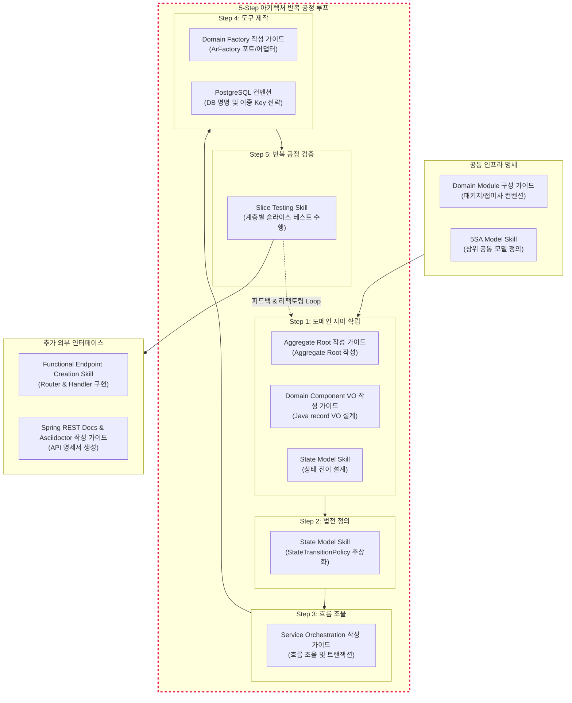

# 개발공정  

개발 공정(Software Development Process)은 소프트웨어를 계획, 설계, 구축, 테스트, 배포 및 유지보수하는 데 필요한 체계적인 단계와 활동의 집합을 의미합니다. 이는 소프트웨어의 품질을 보장하고 프로젝트를 성공적으로 이끌기 위한 일종의 프레임워크입니다.

개발 공정은 다양한 형태의 소프트웨어 개발 모델(Software Development Model, SDLC)을 통해 구현되며, 프로젝트의 성격과 요구사항에 따라 적합한 모델이 선택됩니다.

## 일반적인 개발 공정 단계

대부분의 소프트웨어 개발 공정은 다음의 주요 단계들을 포함합니다.

- 요구사항 분석 및 정의 (Requirement Analysis & Definition):
    - 목표: 시스템이 무엇을 해야 하는지(기능)와 어떻게 작동해야 하는지(비기능)를 고객 및 이해관계자로부터 수집하고 명확히 정의합니다.
    - 결과물: 요구사항 문서 (SRS), 유스케이스 다이어그램.

- 설계 (Design):
    - 목표: 분석된 요구사항을 충족시키기 위한 시스템의 구조(Architecture)와 세부 구현 방안을 결정합니다.
    - 활동: 시스템 아키텍처 설계, 데이터베이스 스키마 설계, 클래스 다이어그램 작성, 사용자 인터페이스(UI) 설계.

- 구현 (Implementation / Coding):
    - 목표: 설계 명세에 따라 실제 코드를 작성하고 모듈을 개발합니다.
    - 활동: 프로그래밍 언어를 사용하여 기능을 코드로 구현하고 단위 테스트를 수행합니다.

- 테스트 및 통합 (Testing & Integration):
    - 목표: 개발된 소프트웨어가 요구사항을 충족시키고 오류 없이 작동하는지 확인합니다.
    - 활동: 단위 테스트, 통합 테스트, 시스템 테스트, 인수 테스트(User Acceptance Test, UAT) 등을 통해 버그를 찾아 수정하고 모든 모듈을 결합합니다.

- 배포 (Deployment):
    - 목표: 완성된 소프트웨어를 사용자가 사용할 수 있도록 실제 운영 환경(Production Environment)에 설치하고 실행합니다.
    - 활동: 서버 환경 설정, Docker/Kubernetes 배포, 데이터 마이그레이션.

- 유지보수 (Maintenance):
    - 목표: 소프트웨어 배포 후 발생하는 모든 문제(버그 수정, 성능 개선, 기능 추가 등)에 대응하여 시스템을 지속적으로 관리합니다.

## 주요 개발 공정 모델

소프트웨어 개발 공정은 어떤 방법론을 채택하느냐에 따라 단계의 순서, 반복 횟수, 피드백 주기가 달라집니다.

### 폭포수 모델 (Waterfall Model)
- 특징: 가장 고전적인 순차적 모델입니다. 한 단계가 완전히 완료된 후에만 다음 단계로 넘어갑니다.
- 장점: 구조가 단순하고 관리하기 쉬우며, 요구사항이 명확하고 변경 가능성이 낮은 프로젝트에 적합합니다.

### 애자일 모델 (Agile Model)
- 특징: 짧은 주기(Sprint)로 개발과 테스트를 반복하며, 고객의 피드백을 빠르게 반영합니다. 유연성과 변화 대응을 중요시합니다.
- 장점: 요구사항 변화가 잦은 프로젝트, 고객과의 협업이 중요한 프로젝트에 매우 효과적입니다. (예: Scrum, Kanban)

### 나선형 모델 (Spiral Model)
- 특징: 위험 분석(Risk Analysis)을 중심으로 개발 과정을 여러 주기로 반복하며 진행합니다. 주기가 반복될 때마다 점진적으로 완성도를 높여 나갑니다.
- 장점: 대규모, 고위험 프로젝트에 적합하며, 중간에 위험을 관리하고 해결할 수 있습니다.

### 프로토타이핑 모델 (Prototyping Model)
- 특징: 사용자에게 빠르게 시제품(프로토타입)을 만들어 보여주고 피드백을 받아 요구사항을 명확히 한 후, 실제 시스템을 구축합니다.
- 장점: 사용자의 요구사항을 정확히 파악하기 어려울 때 효과적입니다.

---

## WBS 란

### 1. WBS(Work Breakdown Structure, 작업 분할 구조도)의 개념

WBS는 프로젝트가 달성해야 하는 최종 산출물을 기준으로 전체 작업 내용을 계층적으로 세분화한 구조도입니다. 거대하고 추상적인 프로젝트 목표를 관리 가능한 크기의 작은 작업 단위(Work Package)로 쪼개어 나가는 톱다운(Top-down) 방식의 기획 도구입니다.

프로젝트 관리의 표준인 PMBOK(Project Management Body of Knowledge)에서는 WBS를 "프로젝트 팀이 프로젝트 목표를 달성하고 필요한 인도물을 창출하기 위해 실행해야 하는 총 작업 범위의 계층적 분할"로 정의합니다.


### 2. WBS의 핵심 구성 요소

WBS는 일반적으로 트리 구조나 스프레드시트 형태로 작성되며, 다음과 같은 핵심 요소를 포함합니다.

* 인도물 중심 분할 (Deliverable-Oriented): 활동(Activity) 중심이 아니라, 최종적으로 만들어내야 하는 '결과물'이나 '마일스톤'을 기준으로 최상위 계층을 나눕니다.
* 100% 룰 (100% Rule): 하위 계층 작업들의 합은 반드시 직 상위 계층 작업의 100%를 구성해야 합니다. 누락되거나 중복되는 작업이 없어야 한다는 원칙입니다.
* 워크 패키지 (Work Package): WBS의 최하위에 위치하는 가장 작은 작업 단위입니다. 일반적으로 한 사람 또는 하나의 팀이 독립적으로 수행할 수 있고, 일정과 비용을 구체적으로 추정할 수 있는 수준(통상 8시간~80시간 소요 규모)까지 쪼갠 상태를 말합니다.
* WBS 사전 (WBS Dictionary): WBS 구조도 내에 다 담지 못한 구체적인 작업 내용, 담당자, 승인 조건, 자원 등을 상세히 기록한 명세서입니다.


### 3. WBS를 작성해야 하는 이유 (필요성)

* 범위 관리 (Scope Management): 프로젝트에서 해야 할 일과 하지 말아야 할 일의 경계를 명확히 하여 범위 산정 오류(Scope Creep)를 방지합니다.
* 일정 및 비용 추정의 정확도 향상: 큰 덩어리의 추상적인 작업보다 잘게 쪼개진 워크 패키지 단위로 공수를 산정할 때 예측 정밀도가 훨씬 높아집니다.
* R&R(역할과 책임) 명확화: 최하위 워크 패키지마다 명확한 담당자(Owner)를 지정할 수 있어 책임 소재가 분명해집니다.
* 일정 계획(Schedule)의 기초: WBS를 통해 도출된 워크 패키지들을 선후 관계에 따라 배열하고 마일스톤을 부여하면, 우리가 흔히 보는 간트 차트(Gantt Chart)나 네트워크 다이어그램으로 발전하게 됩니다.

### 4. WBS의 구조 예시 (계층식 표 형태)

```
1.0 신규 모바일 앱 개발 프로젝트
   1.1 요구사항 분석 및 설계
       1.1.1 기능 요구사항 정의서 작성
       1.1.2 UI/UX 와이어프레임 설계
   1.2 시스템 아키텍처 구축
       1.2.1 클라우드 인프라 환경 설정
       1.2.2 데이터베이스 스키마 설계
   1.3 프론트엔드 개발
       1.3.1 회원가입 및 로그인 화면 구현
       1.3.2 메인 대시보드 화면 구현
   1.4 백엔드 API 개발
       1.4.1 인증/인가 모듈 개발
       1.4.2 데이터 조회 및 처리 API 개발
   1.5 통합 테스트 및 배포
       1.5.1 시나리오 기반 QA 테스트
       1.5.2 스토어 등록 및 프로덕션 배포

```

### 5. WBS와 간트 차트(Gantt Chart)의 차이점

많은 경우 WBS와 간트 차트를 혼동합니다. 스프레드시트 툴에서 좌측에 WBS 구조를 쓰고, 우측에 달력 형태의 바(Bar) 차트를 붙여서 한 번에 관리하기 때문입니다. 하지만 개념적으로는 명확히 구분됩니다.

| 구분 | WBS (작업 분할 구조도) | 간트 차트 (Gantt Chart) |
| --- | --- | --- |
| 핵심 목적 | 프로젝트의 전체 범위(Scope)와 계층 구조 파악 | 프로젝트의 일정(Schedule)과 진행 상황 시각화 |
| 중심 요소 | 인도물, 작업의 계층 관계 (무엇을 해야 하는가) | 시간 축, 시작/종료일, 작업 간의 선후 관계, 의존성 |
| 표현 방식 | 트리 구조, 조직도 형태, 번호 매겨진 목록 | 가로형 바(Bar) 차트, 타임라인 |

---

WBS는 프로젝트라는 거대한 퍼즐을 맞추기 전에, 어떤 퍼즐 조각들이 필요한지 바닥에 먼저 분류하여 펼쳐놓는 작업과 같습니다. 이 첫 단추가 잘 꿰어져야 후속 일정 계획과 리소스 배정이 원활해집니다.

WBS 작성 기법이나 특정 도구 활용법 등 추가로 궁금한 부분이 있으신가요?

---

## 5-Step Process

5-Step Process는 단일 모듈의 도메인 모델 중심의 개발 공정입니다. Agentic Engineering을 지원합니다. 

